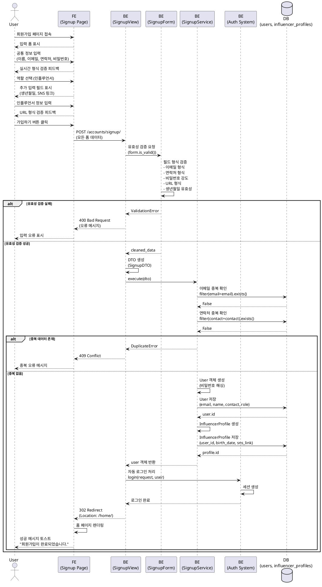

# 유스케이스 명세: 인플루언서 회원가입 및 온보딩

## 유스케이스 ID: UC-001

### 제목
인플루언서 회원가입 및 온보딩 프로세스

---

## 1. 개요

### 1.1 목적
블로거, 유튜버, 인스타그램 등 SNS 채널 운영자가 체험단 매칭 플랫폼에 인플루언서로 회원가입하고, SNS 정보를 등록하여 체험단 지원 자격을 획득한다.

### 1.2 범위
- 회원가입 폼 입력 및 제출
- 역할 선택 (인플루언서)
- 인플루언서 전용 정보 입력 (생년월일, SNS 채널)
- 계정 생성 및 자동 로그인
- 홈 페이지로 리디렉션

**제외 사항**:
- 이메일 인증 프로세스
- SNS 채널 검증 (추후 구현)
- 프로필 사진 업로드

### 1.3 액터
- **주요 액터**: 미가입 사용자 (인플루언서 지망자)
- **부 액터**: 인증 시스템, 데이터베이스

---

## 2. 선행 조건

- 사용자는 로그인하지 않은 상태이다.
- 사용자는 회원가입 페이지에 접근할 수 있다.
- 사용자는 유효한 이메일 주소와 연락처를 보유하고 있다.
- 사용자는 하나 이상의 SNS 채널 (Naver Blog, YouTube, Instagram, Threads)을 운영하고 있다.

---

## 3. 참여 컴포넌트

- **회원가입 페이지 (FE)**: 사용자 입력 폼 제공 및 유효성 검증
- **회원가입 View (BE)**: HTTP 요청 처리 및 오케스트레이션
- **Form Validator (BE)**: 입력 데이터 형식 검증
- **회원가입 Service (BE)**: 비즈니스 로직 처리 및 데이터 생성
- **User Model (DB)**: 공통 사용자 정보 저장
- **Influencer Profile Model (DB)**: 인플루언서 전용 정보 저장
- **Django Authentication System (BE)**: 비밀번호 해싱 및 로그인 처리

---

## 4. 기본 플로우 (Basic Flow)

### 4.1 단계별 흐름

#### Step 1: 회원가입 페이지 접속
- **사용자**: 회원가입 페이지 URL에 접속한다.
- **입력**: 없음
- **처리**: 회원가입 폼이 렌더링된다.
- **출력**: 공통 정보 입력 폼 표시

#### Step 2: 공통 정보 입력
- **사용자**: 필수 공통 정보를 입력한다.
  - 이름 (name)
  - 이메일 (email)
  - 연락처 (contact)
  - 비밀번호 (password)
  - 비밀번호 확인 (password_confirm)
  - 약관 동의 체크박스
- **입력**: 텍스트 및 체크박스 값
- **처리**: 클라이언트 측 실시간 형식 검증
- **출력**: 유효성 피드백 표시 (선택)

#### Step 3: 역할 선택
- **사용자**: '인플루언서' 라디오 버튼을 선택한다.
- **입력**: role = 'influencer'
- **처리**: 인플루언서 전용 입력 필드가 동적으로 표시된다.
- **출력**: 추가 정보 입력 폼 표시

#### Step 4: 인플루언서 전용 정보 입력
- **사용자**: 인플루언서 관련 정보를 입력한다.
  - 생년월일 (birth_date)
  - SNS 채널 링크 (sns_link)
    - 형식: Naver Blog, YouTube, Instagram, Threads URL
- **입력**: 날짜 및 URL 텍스트
- **처리**: 클라이언트 측 URL 형식 검증
- **출력**: 유효성 피드백 표시

#### Step 5: 회원가입 제출
- **사용자**: '가입하기' 버튼을 클릭한다.
- **입력**: 전체 폼 데이터
- **처리**:
  - POST 요청이 백엔드로 전송된다.
  - 요청 헤더에 CSRF 토큰 포함
- **출력**: 로딩 인디케이터 표시

#### Step 6: 서버 측 유효성 검증
- **백엔드 Form Validator**:
  - 모든 필드의 형식을 검증한다.
  - 이메일 형식 검증 (정규식)
  - 연락처 형식 검증 (한국 전화번호 형식)
  - 비밀번호 강도 검증 (최소 8자, 영문+숫자 조합)
  - 비밀번호 일치 확인
  - SNS 링크 URL 형식 검증 (http/https)
  - 생년월일 유효성 검증 (과거 날짜, 만 14세 이상)
  - 약관 동의 여부 확인

#### Step 7: 중복 확인
- **회원가입 Service**: 데이터베이스에 중복 데이터 조회
  - 이메일 중복 확인: `User.objects.filter(email=email).exists()`
  - 연락처 중복 확인: `User.objects.filter(contact=contact).exists()`
- **처리**: 중복 데이터 존재 시 예외 발생
- **출력**: 중복 오류 또는 통과

#### Step 8: 사용자 계정 생성
- **회원가입 Service**:
  - User 모델 인스턴스 생성
  - 비밀번호 해싱 처리 (`make_password()` 또는 `set_password()`)
  - 데이터베이스에 저장
- **처리**:
  ```python
  user = User.objects.create(
      email=dto.email,
      name=dto.name,
      contact=dto.contact,
      role='influencer'
  )
  user.set_password(dto.password)
  user.save()
  ```
- **출력**: User 객체 생성 완료

#### Step 9: 인플루언서 프로필 생성
- **회원가입 Service**:
  - Influencer Profile 모델 인스턴스 생성
  - 생성된 User ID와 1:1 매핑
  - 데이터베이스에 저장
- **처리**:
  ```python
  influencer_profile = InfluencerProfile.objects.create(
      user_id=user.id,
      birth_date=dto.birth_date,
      sns_link=dto.sns_link
  )
  ```
- **출력**: InfluencerProfile 객체 생성 완료

#### Step 10: 자동 로그인 처리
- **회원가입 View**:
  - Django 인증 시스템을 사용하여 사용자를 로그인 상태로 전환
  - 세션에 사용자 정보 저장
- **처리**:
  ```python
  from django.contrib.auth import login
  login(request, user)
  ```
- **출력**: 세션 쿠키 생성

#### Step 11: 홈 페이지 리디렉션
- **회원가입 View**:
  - 성공 응답 반환
  - 홈 페이지 URL로 리디렉션
- **처리**: `return redirect('home')`
- **출력**: HTTP 302 리디렉션 응답

#### Step 12: 성공 피드백 표시
- **홈 페이지 (FE)**:
  - "회원가입이 완료되었습니다." 토스트 메시지 표시
  - 헤더에 로그인 상태 반영 (사용자 이름 표시)
- **출력**: 사용자 피드백

### 4.2 시퀀스 다이어그램



---

## 5. 대안 플로우 (Alternative Flows)

### 5.1 대안 플로우 1: 광고주로 가입하려는 경우

**시작 조건**: Step 3 (역할 선택) 시점

**단계**:
1. 사용자가 '광고주' 라디오 버튼을 선택한다.
2. 광고주 전용 입력 필드가 표시된다 (업체명, 사업자등록번호 등).
3. 이후 프로세스는 UC-002 (광고주 회원가입)를 따른다.

**결과**: 광고주 계정 생성 및 체험단 관리 페이지로 리디렉션

---

## 6. 예외 플로우 (Exception Flows)

### 6.1 예외 상황 1: 이메일 중복

**발생 조건**: Step 7에서 이미 등록된 이메일이 확인된 경우

**처리 방법**:
1. Service에서 `DuplicateEmailError` 예외 발생
2. View에서 예외를 캐치하고 폼에 오류 추가
3. HTTP 409 Conflict 응답 반환
4. 프론트엔드에서 이메일 필드 아래에 오류 메시지 표시

**에러 코드**: `409 Conflict`

**사용자 메시지**: "이미 가입된 이메일입니다. 로그인하거나 다른 이메일을 사용해주세요."

### 6.2 예외 상황 2: 연락처 중복

**발생 조건**: Step 7에서 이미 등록된 연락처가 확인된 경우

**처리 방법**:
1. Service에서 `DuplicateContactError` 예외 발생
2. View에서 예외를 캐치하고 폼에 오류 추가
3. HTTP 409 Conflict 응답 반환
4. 프론트엔드에서 연락처 필드 아래에 오류 메시지 표시

**에러 코드**: `409 Conflict`

**사용자 메시지**: "이미 가입된 연락처입니다. 다른 번호를 사용해주세요."

### 6.3 예외 상황 3: 유효하지 않은 SNS 링크 형식

**발생 조건**: Step 6에서 SNS 링크가 올바른 URL 형식이 아닌 경우

**처리 방법**:
1. Form Validator에서 `URLValidator` 사용
2. 유효성 검증 실패 시 `ValidationError` 발생
3. HTTP 400 Bad Request 응답 반환
4. SNS 링크 필드 아래에 오류 메시지 표시

**에러 코드**: `400 Bad Request`

**사용자 메시지**: "올바른 URL 형식으로 입력해주세요. (예: https://blog.naver.com/username)"

### 6.4 예외 상황 4: 생년월일 유효성 오류

**발생 조건**:
- Step 6에서 미래 날짜를 입력한 경우
- 만 14세 미만인 경우 (비즈니스 규칙)

**처리 방법**:
1. Form Validator에서 날짜 검증
2. `ValidationError` 발생
3. HTTP 400 Bad Request 응답 반환
4. 생년월일 필드 아래에 오류 메시지 표시

**에러 코드**: `400 Bad Request`

**사용자 메시지**:
- "올바른 생년월일을 입력해주세요."
- "만 14세 이상만 가입 가능합니다."

### 6.5 예외 상황 5: 비밀번호 불일치

**발생 조건**: Step 6에서 비밀번호와 비밀번호 확인 값이 다른 경우

**처리 방법**:
1. Form Validator의 `clean()` 메서드에서 비교
2. `ValidationError` 발생
3. HTTP 400 Bad Request 응답 반환
4. 비밀번호 확인 필드에 오류 메시지 표시

**에러 코드**: `400 Bad Request`

**사용자 메시지**: "비밀번호가 일치하지 않습니다."

### 6.6 예외 상황 6: 약관 미동의

**발생 조건**: Step 6에서 필수 약관에 동의하지 않은 경우

**처리 방법**:
1. Form Validator에서 체크박스 값 검증
2. `ValidationError` 발생
3. HTTP 400 Bad Request 응답 반환
4. 약관 동의 섹션에 오류 메시지 표시

**에러 코드**: `400 Bad Request`

**사용자 메시지**: "필수 약관에 동의해주세요."

### 6.7 예외 상황 7: 데이터베이스 트랜잭션 실패

**발생 조건**: Step 8 또는 Step 9에서 데이터베이스 저장 중 오류 발생

**처리 방법**:
1. Django의 `transaction.atomic()` 데코레이터 사용
2. 트랜잭션 롤백 자동 처리
3. Service에서 `DatabaseError` 예외 발생
4. View에서 예외를 캐치하고 HTTP 500 응답 반환
5. 일반적인 오류 페이지 표시

**에러 코드**: `500 Internal Server Error`

**사용자 메시지**: "일시적인 오류가 발생했습니다. 잠시 후 다시 시도해주세요."

**로깅**:
- 오류 상세 정보를 서버 로그에 기록
- 필요 시 개발팀에 알림 전송

### 6.8 예외 상황 8: 가입 절차 중 페이지 이탈

**발생 조건**: 사용자가 폼 입력 중 페이지를 벗어나는 경우

**처리 방법**:
1. 입력된 데이터는 서버로 전송되지 않음
2. 데이터베이스에 아무 변경도 발생하지 않음
3. 사용자가 다시 회원가입 페이지로 돌아오면 빈 폼이 표시됨

**결과**: 데이터 미저장, 부작용 없음

---

## 7. 후행 조건 (Post-conditions)

### 7.1 성공 시

**데이터베이스 변경**:
- `users` 테이블에 새로운 레코드 1건 생성
  - `id`: 자동 생성
  - `email`: 입력값
  - `password`: 해싱된 비밀번호
  - `name`: 입력값
  - `contact`: 입력값
  - `role`: 'influencer'
  - `created_at`: 현재 시각
  - `updated_at`: 현재 시각

- `influencer_profiles` 테이블에 새로운 레코드 1건 생성
  - `user_id`: 생성된 user.id (FK)
  - `birth_date`: 입력값
  - `sns_link`: 입력값

**시스템 상태**:
- 사용자는 로그인 상태로 전환됨
- 세션에 사용자 정보 저장됨
- 인플루언서로서 모든 기능 사용 가능 (체험단 지원, 내 지원 목록 확인 등)

**사용자 경험**:
- 홈 페이지에서 로그인된 상태 확인 가능
- 체험단 상세 페이지에서 '지원하기' 버튼 활성화

### 7.2 실패 시

**데이터 롤백**:
- 트랜잭션 내에서 처리되므로, 오류 발생 시 모든 데이터베이스 변경 사항이 롤백됨
- `users` 테이블과 `influencer_profiles` 테이블 모두 변경되지 않음

**시스템 상태**:
- 사용자는 비로그인 상태를 유지함
- 회원가입 페이지에 머무름
- 입력된 데이터 유지 (비밀번호 제외)

**사용자 경험**:
- 오류 메시지를 확인하고 수정 후 재시도 가능

---

## 8. 비기능 요구사항

### 8.1 성능
- **응답 시간**: 정상적인 네트워크 환경에서 가입 처리 완료까지 3초 이내
- **동시 처리**: 동시 회원가입 요청 10건까지 지연 없이 처리
- **데이터베이스 쿼리**: 회원가입 1건당 최대 4개의 쿼리 실행 (중복 확인 2회, 생성 2회)

### 8.2 보안
- **비밀번호 보안**:
  - Django의 기본 PBKDF2 알고리즘 사용
  - 최소 8자, 영문+숫자 조합 강제
  - 평문 비밀번호는 로그에 기록하지 않음
- **CSRF 보호**: Django CSRF 미들웨어 활성화
- **SQL Injection 방지**: Django ORM 사용으로 자동 처리
- **XSS 방지**: Django 템플릿 자동 이스케이프 활성화
- **HTTPS 강제**: 프로덕션 환경에서 HTTP는 HTTPS로 리디렉션

### 8.3 가용성
- **시스템 가동 시간**: MVP 단계에서 95% 가용성 목표
- **데이터 백업**: Railway Volume을 통한 데이터 영구 저장
- **복구 시간**: 서비스 장애 발생 시 1시간 내 복구 목표

### 8.4 데이터 무결성
- **트랜잭션 관리**: `transaction.atomic()` 사용으로 원자성 보장
- **외래 키 제약**: `influencer_profiles.user_id`는 `users.id`를 참조
- **UNIQUE 제약**: 이메일, 연락처 중복 방지
- **NOT NULL 제약**: 필수 필드의 NULL 값 방지

---

## 9. UI/UX 요구사항

### 9.1 화면 구성

**회원가입 페이지 레이아웃**:
- 페이지 제목: "회원가입"
- 진행 단계 인디케이터 (선택): "기본 정보 입력 → 역할 선택 → 추가 정보 입력"

**입력 필드**:
1. 공통 정보 섹션
   - 이름 (텍스트 필드, 필수)
   - 이메일 (이메일 필드, 필수)
   - 연락처 (텍스트 필드, 필수, 플레이스홀더: "010-0000-0000")
   - 비밀번호 (비밀번호 필드, 필수)
   - 비밀번호 확인 (비밀번호 필드, 필수)

2. 역할 선택 섹션
   - 라디오 버튼 그룹: "광고주" / "인플루언서"

3. 인플루언서 전용 섹션 (조건부 표시)
   - 생년월일 (날짜 선택 필드, 필수)
   - SNS 채널 링크 (텍스트 필드, 필수, 플레이스홀더: "SNS 채널 URL을 입력하세요")

4. 약관 동의 섹션
   - 체크박스: "이용약관에 동의합니다 (필수)"
   - 체크박스: "개인정보처리방침에 동의합니다 (필수)"

5. 액션 버튼
   - "가입하기" 버튼 (Primary CTA)
   - "로그인" 링크 (이미 계정이 있는 경우)

**반응형 디자인**:
- 모바일: 단일 컬럼 레이아웃
- 태블릿/데스크톱: 중앙 정렬, 최대 너비 600px

### 9.2 사용자 경험

**실시간 피드백**:
- 이메일 형식 오류 시 즉시 빨간색 테두리 및 오류 메시지 표시
- 비밀번호 강도 인디케이터 표시 (약함 / 보통 / 강함)
- 비밀번호 불일치 시 즉시 피드백

**로딩 상태**:
- 가입하기 버튼 클릭 시 버튼 비활성화 및 스피너 표시
- "처리 중입니다..." 텍스트 표시

**성공 피드백**:
- 홈 페이지 상단에 녹색 토스트 메시지 3초간 표시
- 헤더에 사용자 이름 표시

**오류 피드백**:
- 서버 오류 시 빨간색 토스트 메시지 표시
- 필드별 인라인 오류 메시지 표시
- 오류가 발생한 첫 번째 필드로 스크롤 이동

**접근성**:
- 모든 입력 필드에 적절한 label 제공
- 오류 메시지는 스크린 리더가 읽을 수 있도록 aria-live 속성 사용
- 키보드만으로 전체 프로세스 완료 가능

---

## 10. 테스트 시나리오

### 10.1 성공 케이스

| 테스트 케이스 ID | 입력값 | 기대 결과 |
|----------------|--------|----------|
| TC-001-01 | 유효한 모든 정보 입력 (이름: "홍길동", 이메일: "test@example.com", 연락처: "010-1234-5678", 비밀번호: "Password123", 생년월일: "1990-01-01", SNS: "https://blog.naver.com/test") | 회원가입 성공, 홈 페이지 리디렉션, 로그인 상태 |
| TC-001-02 | 최소 길이 비밀번호 (8자) | 가입 성공 |
| TC-001-03 | 다양한 SNS 플랫폼 URL (YouTube, Instagram, Threads) | 모두 정상 가입 |

### 10.2 실패 케이스

| 테스트 케이스 ID | 입력값 | 기대 결과 |
|----------------|--------|----------|
| TC-001-E01 | 중복된 이메일 | 409 Conflict, "이미 가입된 이메일입니다." 오류 메시지 |
| TC-001-E02 | 중복된 연락처 | 409 Conflict, "이미 가입된 연락처입니다." 오류 메시지 |
| TC-001-E03 | 잘못된 이메일 형식 ("test@") | 400 Bad Request, "올바른 이메일 형식이 아닙니다." 오류 메시지 |
| TC-001-E04 | 비밀번호 불일치 | 400 Bad Request, "비밀번호가 일치하지 않습니다." 오류 메시지 |
| TC-001-E05 | 약관 미동의 | 400 Bad Request, "필수 약관에 동의해주세요." 오류 메시지 |
| TC-001-E06 | 잘못된 SNS URL 형식 ("naver.com") | 400 Bad Request, "올바른 URL 형식으로 입력해주세요." 오류 메시지 |
| TC-001-E07 | 미래 날짜 생년월일 | 400 Bad Request, "올바른 생년월일을 입력해주세요." 오류 메시지 |
| TC-001-E08 | 만 14세 미만 생년월일 | 400 Bad Request, "만 14세 이상만 가입 가능합니다." 오류 메시지 |
| TC-001-E09 | 비밀번호 7자 이하 | 400 Bad Request, "비밀번호는 최소 8자 이상이어야 합니다." 오류 메시지 |
| TC-001-E10 | 필수 필드 누락 (이름 없음) | 400 Bad Request, "이름을 입력해주세요." 오류 메시지 |

### 10.3 경계값 테스트

| 테스트 케이스 ID | 입력값 | 기대 결과 |
|----------------|--------|----------|
| TC-001-B01 | 비밀번호 정확히 8자 | 성공 |
| TC-001-B02 | 이름 1자 | 성공 (최소 길이 제한 없음) |
| TC-001-B03 | 이름 100자 (최대 길이) | 성공 |
| TC-001-B04 | 정확히 만 14세 생일 | 성공 |
| TC-001-B05 | 만 14세 생일 - 1일 | 실패 |

---

## 11. 비즈니스 규칙 (Business Rules)

### BR-001: 최소 연령 제한
- 인플루언서는 만 14세 이상이어야 가입 가능하다.
- 생년월일을 기준으로 계산하며, 오늘 날짜 - 생년월일 >= 14년이어야 한다.

### BR-002: 이메일 고유성
- 한 이메일 주소는 하나의 계정에만 연결될 수 있다.
- 광고주와 인플루언서 모두 동일한 `users` 테이블을 사용하므로, 역할과 무관하게 이메일은 고유해야 한다.

### BR-003: 연락처 고유성
- 한 연락처는 하나의 계정에만 연결될 수 있다.

### BR-004: 비밀번호 정책
- 최소 8자 이상
- 영문자와 숫자를 반드시 포함
- 특수문자 포함 권장 (강제는 아님)

### BR-005: SNS 채널 필수
- 인플루언서는 최소 하나의 SNS 채널 링크를 등록해야 한다.
- MVP 단계에서는 단일 URL 필드만 제공하며, 여러 채널은 쉼표로 구분하거나 주요 채널 하나만 입력한다.

### BR-006: 역할 고정
- 회원가입 시 선택한 역할 (광고주/인플루언서)은 이후 변경할 수 없다.
- 양쪽 역할이 모두 필요한 경우, 별도 계정을 생성해야 한다.

### BR-007: 자동 로그인
- 회원가입 성공 시 별도의 로그인 절차 없이 자동으로 로그인 상태로 전환된다.

---

## 12. 관련 유스케이스

### 선행 유스케이스
- 없음 (회원가입은 첫 번째 진입점)

### 후행 유스케이스
- **UC-003**: 체험단 지원 (인플루언서가 회원가입 후 수행할 수 있는 주요 액션)
- **UC-004**: 내 지원 목록 확인

### 연관 유스케이스
- **UC-002**: 광고주 회원가입 및 온보딩 (동일한 회원가입 플로우의 분기)
- **UC-999**: 로그인 (이미 계정이 있는 사용자)

---

## 13. 구현 참고사항

### 13.1 기술 스택 적용

**Django 프레임워크 활용**:
- `django.contrib.auth.models.User`를 확장한 커스텀 User 모델 사용
- `AbstractUser` 또는 `AbstractBaseUser` 상속
- `UserCreationForm`을 확장한 커스텀 회원가입 폼 생성

**Layered Architecture 적용**:
```
apps/users/
├── views.py                  # SignupView (HTTP 요청 처리)
├── forms.py                  # SignupForm (유효성 검증)
├── dto.py                    # SignupDTO (데이터 계약)
├── services/
│   └── signup_service.py     # SignupService (비즈니스 로직)
├── models.py                 # User, InfluencerProfile 모델
└── templates/
    └── users/
        └── signup.html       # 회원가입 페이지
```

### 13.2 보안 체크리스트

- [ ] CSRF 토큰이 모든 POST 요청에 포함되는가?
- [ ] 비밀번호는 절대 평문으로 저장하지 않는가?
- [ ] SQL Injection 방지를 위해 ORM을 사용하는가?
- [ ] XSS 방지를 위해 사용자 입력을 이스케이프하는가?
- [ ] HTTPS를 프로덕션 환경에서 강제하는가?

### 13.3 데이터베이스 마이그레이션

회원가입 기능 구현 전에 필요한 마이그레이션:
```bash
python manage.py makemigrations users
python manage.py migrate users
```

### 13.4 환경 변수

`.env` 파일에 설정해야 할 항목:
```
SECRET_KEY=your-secret-key-here
DEBUG=False
ALLOWED_HOSTS=your-domain.com
RAILWAY_VOLUME_MOUNT_PATH=/data
```

---

## 14. 변경 이력

| 버전 | 날짜 | 작성자 | 변경 내용 |
|------|------|--------|-----------|
| 1.0  | 2025-11-16 | Claude | 초기 작성 |

---

## 부록

### A. 용어 정의

- **인플루언서 (Influencer)**: SNS 채널을 운영하며 팔로워에게 영향력을 행사하는 개인. 본 플랫폼에서는 체험단에 지원하는 역할.
- **온보딩 (Onboarding)**: 신규 사용자가 서비스에 가입하고 초기 설정을 완료하는 전체 프로세스.
- **DTO (Data Transfer Object)**: 계층 간 데이터 전송을 위한 불변 객체.
- **CSRF (Cross-Site Request Forgery)**: 사용자가 의도하지 않은 요청을 서버로 전송하도록 유도하는 공격.
- **해싱 (Hashing)**: 비밀번호를 복호화할 수 없는 형태로 변환하는 단방향 암호화 기법.

### B. 참고 자료

- Django 공식 문서: https://docs.djangoproject.com/
- Django Authentication System: https://docs.djangoproject.com/en/stable/topics/auth/
- Django Form Validation: https://docs.djangoproject.com/en/stable/ref/forms/validation/
- OWASP Top 10 (보안): https://owasp.org/www-project-top-ten/
- PlantUML 문서: https://plantuml.com/sequence-diagram
