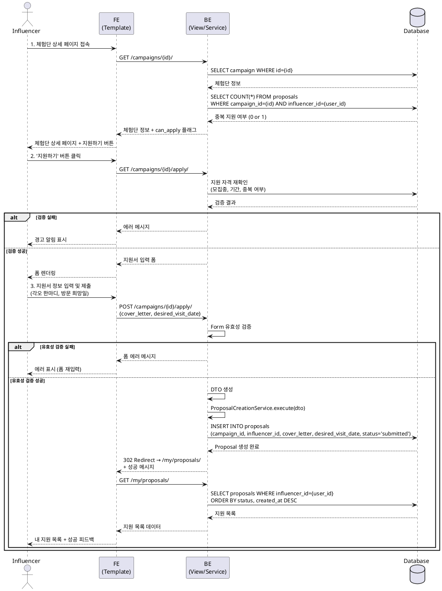

# 유스케이스 명세서: UC-002

## 제목
체험단 지원 (Campaign Application)

---

## 1. 개요

### 1.1 목적
인플루언서가 관심 있는 체험단 캠페인에 지원하여 참여 기회를 얻을 수 있도록 한다. 이를 통해 광고주는 자신의 제품/서비스를 홍보할 적합한 인플루언서를 확보하고, 인플루언서는 새로운 경험과 혜택을 얻을 수 있다.

### 1.2 범위
- 인플루언서가 모집 중인 체험단에 지원서를 작성하고 제출하는 프로세스
- 지원서 유효성 검증 및 데이터 저장
- 지원 상태 확인 및 피드백 제공
- **제외 사항**: 지원서 수정/취소, 체험단 선정 프로세스

### 1.3 액터
- **주요 액터**: 인플루언서 (Influencer)
- **부 액터**:
  - 시스템 (체험단 매칭 플랫폼)
  - 광고주 (지원 현황 조회 시)

---

## 2. 선행 조건

- 사용자가 인플루언서 역할로 회원가입을 완료한 상태
- 사용자가 로그인되어 있는 상태
- 인플루언서 프로필 정보(생년월일, SNS 링크 등)가 등록된 상태
- 지원하려는 체험단이 '모집 중(recruiting)' 상태
- 지원하려는 체험단의 모집 기간(recruitment_end_date) 내

---

## 3. 참여 컴포넌트

- **Frontend (Template)**:
  - 체험단 상세 페이지 (`campaigns/<int:pk>/`)
  - 체험단 지원 페이지 (`campaigns/<int:pk>/apply/`)
  - 내 지원 목록 페이지 (`my/proposals/`)

- **Backend (Django)**:
  - `CampaignDetailView`: 체험단 상세 정보 조회 및 지원 가능 여부 확인
  - `ProposalCreateView`: 지원서 작성 폼 제공 및 제출 처리
  - `ProposalCreateForm`: 지원서 입력 데이터 유효성 검증
  - `ProposalCreationService`: 지원 비즈니스 로직 처리

- **Database**:
  - `campaigns` 테이블: 체험단 정보 및 상태 조회
  - `proposals` 테이블: 지원 정보 생성 및 저장
  - `users`, `influencer_profiles`: 지원자 정보 조회

---

## 4. 기본 플로우 (Basic Flow)

### 4.1 단계별 흐름

1. **인플루언서**: 홈 페이지에서 관심 있는 체험단 카드를 클릭하여 상세 페이지로 이동
   - 입력: 체험단 ID (URL 파라미터)
   - 처리: GET `/campaigns/<int:pk>/`
   - 출력: 체험단 상세 정보 페이지 렌더링

2. **시스템**: 체험단 상세 정보 조회 및 지원 가능 여부 확인
   - 입력: campaign_id, 현재 로그인 사용자 정보
   - 처리:
     - `campaigns` 테이블에서 해당 ID의 체험단 조회
     - 현재 사용자가 인플루언서 역할인지 확인
     - 체험단 상태가 'recruiting'인지 확인
     - 모집 기간이 유효한지 확인 (오늘 <= recruitment_end_date)
     - 해당 인플루언서가 이미 지원했는지 중복 확인 (`proposals` 테이블 조회)
   - 출력:
     - 체험단 정보 (이름, 혜택, 미션, 모집인원, 기간 등)
     - 지원 가능 여부 플래그 (can_apply: true/false)

3. **인플루언서**: 체험단 정보를 확인하고 '지원하기' 버튼 클릭
   - 입력: 사용자 클릭 이벤트
   - 처리: GET `/campaigns/<int:pk>/apply/`
   - 출력: 체험단 지원 페이지로 이동

4. **시스템**: 지원 페이지 렌더링 및 지원 가능 여부 재확인
   - 입력: campaign_id
   - 처리:
     - 동일한 유효성 검증 수행 (모집 중, 기간 내, 중복 지원 확인)
     - 검증 실패 시 에러 처리 (Exception Flow로 분기)
   - 출력: 지원서 입력 폼 (각오 한마디, 방문 희망일)

5. **인플루언서**: 지원서 정보 입력 및 제출
   - 입력:
     - `cover_letter`: 각오 한마디 (텍스트, 필수, 1-500자)
     - `desired_visit_date`: 방문 희망일 (날짜, 필수, 오늘 이후 날짜)
   - 처리: POST `/campaigns/<int:pk>/apply/`
   - 출력: 폼 데이터 전송

6. **시스템 (ProposalCreateForm)**: 입력 데이터 유효성 검증
   - 입력: POST 요청 데이터
   - 처리:
     - `cover_letter` 필드: 공백 여부, 길이 제한 검증
     - `desired_visit_date` 필드: 날짜 형식, 과거 날짜 여부 검증
   - 출력:
     - 성공 시: cleaned_data 생성
     - 실패 시: 검증 에러 메시지 반환 (Exception Flow)

7. **시스템 (ProposalCreateView)**: 지원 자격 최종 확인 및 DTO 생성
   - 입력:
     - Form cleaned_data
     - campaign_id (URL 파라미터)
     - request.user (현재 로그인 사용자)
   - 처리:
     - 권한 확인: 사용자가 인플루언서 역할인지 검증
     - 상태 확인: 체험단이 여전히 '모집 중'인지 재확인
     - 중복 지원 확인: 이미 지원한 이력이 있는지 최종 확인
     - ProposalCreateDTO 객체 생성
   - 출력: ProposalCreateDTO 또는 PermissionDenied/ValidationError

8. **시스템 (ProposalCreationService)**: 비즈니스 로직 실행
   - 입력: ProposalCreateDTO
     ```python
     @dataclass(frozen=True)
     class ProposalCreateDTO:
         campaign_id: int
         influencer_id: int
         cover_letter: str
         desired_visit_date: date
     ```
   - 처리:
     - `proposals` 테이블에 새 레코드 생성
       - campaign_id: 지원 대상 캠페인 ID
       - influencer_id: 지원자 ID
       - cover_letter: 각오 한마디
       - desired_visit_date: 방문 희망일
       - status: 'submitted' (신청완료)
       - created_at: 현재 시각
     - UNIQUE 제약조건(campaign_id, influencer_id)에 의한 중복 방지
   - 출력: 생성된 Proposal 객체

9. **시스템**: 성공 피드백 및 리디렉션
   - 입력: 생성된 Proposal 객체
   - 처리:
     - 성공 메시지 생성: "지원이 성공적으로 완료되었습니다."
     - Django messages framework를 통해 메시지 저장
   - 출력:
     - HTTP 302 Redirect → `/my/proposals/` (내 지원 목록 페이지)
     - 성공 메시지 플래시

10. **인플루언서**: 내 지원 목록에서 지원 확인
    - 입력: 없음 (리디렉션 자동)
    - 처리: GET `/my/proposals/`
    - 출력:
      - 지원한 체험단 목록 렌더링 (최신순)
      - 방금 지원한 체험단 상태: '신청완료(submitted)'
      - 성공 메시지 UI 노출 (토스트/배너)

### 4.2 시퀀스 다이어그램



---

## 5. 대안 플로우 (Alternative Flows)

### 5.1 대안 플로우 1: 비로그인 사용자 접근

**시작 조건**: 기본 플로우 Step 1 (체험단 상세 페이지 접속)

**단계**:
1. 시스템이 사용자의 로그인 상태를 확인
2. 비로그인 상태이면 '지원하기' 버튼을 비활성화하거나 숨김
3. 버튼 대신 "로그인이 필요합니다" 안내 메시지 표시
4. (선택적) "로그인하기" 버튼 제공 → 클릭 시 로그인 페이지로 이동

**결과**: 사용자가 로그인 없이 지원할 수 없음을 인지하고, 로그인 페이지로 이동 가능

### 5.2 대안 플로우 2: 광고주 계정으로 접근

**시작 조건**: 기본 플로우 Step 1 (체험단 상세 페이지 접속)

**단계**:
1. 시스템이 로그인 사용자의 역할(role)을 확인
2. 역할이 'advertiser'이면 '지원하기' 버튼을 숨김
3. "광고주는 체험단에 지원할 수 없습니다" 안내 메시지 표시

**결과**: 광고주가 지원 기능에 접근할 수 없음

---

## 6. 예외 플로우 (Exception Flows)

### 6.1 예외 상황 1: 모집 기간 종료

**발생 조건**:
- 사용자가 '지원하기' 버튼 클릭 시점 또는 지원서 제출 시점에 `recruitment_end_date`가 지난 경우

**처리 방법**:
1. 시스템이 현재 날짜와 모집 종료일을 비교
2. 모집 기간이 종료되었음을 감지
3. 지원서 제출을 차단하고 에러 메시지 반환

**에러 코드**: `400 Bad Request`

**사용자 메시지**: "모집 기간이 종료되어 지원할 수 없습니다."

**UI 처리**:
- 지원서 페이지 접근 차단
- 체험단 상세 페이지에서 '지원하기' 버튼 비활성화 또는 "마감" 표시

---

### 6.2 예외 상황 2: 중복 지원

**발생 조건**:
- 동일한 인플루언서가 이미 지원한 체험단에 다시 지원을 시도하는 경우
- Database UNIQUE 제약조건 위반

**처리 방법**:
1. 지원서 제출 전 `proposals` 테이블에서 중복 확인 쿼리 실행
   ```sql
   SELECT COUNT(*) FROM proposals
   WHERE campaign_id = {id} AND influencer_id = {user_id}
   ```
2. 결과가 1 이상이면 중복으로 판단
3. 또는 INSERT 시 IntegrityError 예외 발생 시 중복으로 처리

**에러 코드**: `409 Conflict`

**사용자 메시지**: "이미 지원한 체험단입니다. 내 지원 목록에서 확인하세요."

**UI 처리**:
- 에러 메시지와 함께 지원서 페이지 유지
- "내 지원 목록 바로가기" 링크 제공

---

### 6.3 예외 상황 3: 체험단 상태 변경 (모집 종료됨)

**발생 조건**:
- 지원서 작성 중에 광고주가 체험단 모집을 종료한 경우
- 체험단 상태가 'recruiting'에서 'recruitment_ended' 또는 'selection_complete'로 변경

**처리 방법**:
1. 지원서 제출 시점에 체험단 상태 재확인
2. 상태가 'recruiting'이 아니면 지원 차단

**에러 코드**: `400 Bad Request`

**사용자 메시지**: "해당 체험단의 모집이 종료되었습니다."

**UI 처리**:
- 에러 페이지 또는 알림 모달 표시
- 홈 페이지 또는 다른 모집 중 체험단 목록으로 리디렉션

---

### 6.4 예외 상황 4: 입력 데이터 유효성 검증 실패

**발생 조건**:
- 각오 한마디가 비어있거나 500자 초과
- 방문 희망일이 과거 날짜이거나 형식이 잘못됨

**처리 방법**:
1. Django Form 유효성 검증 실패
2. `form.errors` 딕셔너리에 필드별 에러 메시지 저장
3. 동일한 지원서 페이지를 다시 렌더링하며 에러 메시지 표시

**에러 코드**: `200 OK` (페이지 재렌더링)

**사용자 메시지**:
- `cover_letter` 필드: "각오 한마디를 입력해주세요." 또는 "500자 이내로 입력해주세요."
- `desired_visit_date` 필드: "올바른 날짜를 선택해주세요." 또는 "오늘 이후 날짜를 선택해주세요."

**UI 처리**:
- 에러가 발생한 필드에 빨간색 테두리 및 에러 메시지 표시
- 기존에 입력한 값은 유지하여 사용자가 수정할 수 있도록 함

---

### 6.5 예외 상황 5: 권한 없는 접근

**발생 조건**:
- 인플루언서가 아닌 사용자가 URL을 직접 입력하여 지원 페이지에 접근하는 경우

**처리 방법**:
1. View에서 `request.user.role != 'influencer'` 확인
2. PermissionDenied 예외 발생

**에러 코드**: `403 Forbidden`

**사용자 메시지**: "체험단에 지원할 권한이 없습니다."

**UI 처리**:
- 403 에러 페이지 표시
- 홈 페이지로 돌아가기 버튼 제공

---

### 6.6 예외 상황 6: 존재하지 않는 체험단

**발생 조건**:
- URL에 존재하지 않는 campaign_id를 입력한 경우

**처리 방법**:
1. `Campaign.objects.get(id=pk)` 실행 시 DoesNotExist 예외 발생
2. Http404 예외 발생

**에러 코드**: `404 Not Found`

**사용자 메시지**: "요청하신 체험단을 찾을 수 없습니다."

**UI 처리**:
- 404 에러 페이지 표시
- 홈 페이지 또는 전체 체험단 목록으로 돌아가기 버튼 제공

---

## 7. 후행 조건 (Post-conditions)

### 7.1 성공 시

**데이터베이스 변경**:
- `proposals` 테이블에 새로운 레코드 1건 추가
  - `id`: 자동 증가 (BIGSERIAL)
  - `campaign_id`: 지원 대상 체험단 ID
  - `influencer_id`: 지원자(로그인 사용자) ID
  - `cover_letter`: 입력받은 각오 한마디
  - `desired_visit_date`: 입력받은 방문 희망일
  - `status`: 'submitted' (신청완료)
  - `created_at`: 현재 시각 (자동)
  - `updated_at`: 현재 시각 (자동)

**시스템 상태**:
- 해당 체험단의 지원자 수 증가 (집계 쿼리로 확인 가능)
- 인플루언서의 '내 지원 목록'에 새로운 지원 건 추가
- 광고주는 '광고주용 체험단 상세' 페이지에서 새로운 지원자를 확인 가능

**외부 시스템**:
- (선택적) 이메일/SMS 알림 발송 (광고주에게 "새로운 지원자가 있습니다" 알림)
- (MVP에서는 제외)

### 7.2 실패 시

**데이터 롤백**:
- 트랜잭션 롤백으로 `proposals` 테이블에 어떠한 변경도 발생하지 않음

**시스템 상태**:
- 데이터베이스 상태는 지원 시도 전과 동일
- 사용자는 에러 메시지를 확인하고 재시도 가능
- 로그에 에러 상황 기록 (디버깅 및 모니터링 목적)

---

## 8. 비기능 요구사항

### 8.1 성능
- **응답 시간**: 지원서 제출 후 페이지 리디렉션까지 2초 이내 (일반적인 네트워크 환경)
- **처리량**: 동일 체험단에 대해 초당 10건 이상의 지원 요청 처리 가능
- **데이터베이스 쿼리 최적화**:
  - 중복 확인 쿼리는 인덱스 활용 (`idx_proposals_campaign_id`, `idx_proposals_influencer_id`)
  - UNIQUE 제약조건으로 데이터베이스 레벨 중복 방지

### 8.2 보안
- **인증**: 모든 지원 요청은 로그인된 사용자만 수행 가능 (`@login_required` 데코레이터)
- **권한**: 인플루언서 역할만 지원 가능 (역할 기반 접근 제어)
- **CSRF 보호**: Django의 CSRF 토큰을 통해 POST 요청 보호
- **SQL Injection 방지**: Django ORM 사용으로 자동 방지
- **XSS 방지**: Django Template Auto-Escaping으로 사용자 입력 데이터 자동 이스케이프

### 8.3 가용성
- **에러 핸들링**: 모든 예외 상황에 대해 명확한 사용자 피드백 제공
- **트랜잭션 처리**: 데이터베이스 일관성 보장 (ACID 속성)
- **로깅**: 모든 지원 시도 및 에러는 로그에 기록하여 장애 추적 가능

---

## 9. UI/UX 요구사항

### 9.1 화면 구성

**체험단 상세 페이지 (`campaigns/<int:pk>/`)**:
- 체험단 기본 정보 영역 (상단)
  - 체험단명
  - 모집 기간 (recruitment_start_date ~ recruitment_end_date)
  - 모집 인원
  - 제공 혜택
  - 미션 내용
- 지원 액션 영역 (하단)
  - 조건부 렌더링:
    - 로그인 + 인플루언서 + 모집 중 + 미지원: "지원하기" 버튼 (primary, 활성화)
    - 로그인 + 인플루언서 + 이미 지원: "지원 완료" 버튼 (disabled) + "내 지원 목록에서 확인하기" 링크
    - 비로그인: "로그인 후 지원 가능합니다" 안내 + "로그인하기" 버튼
    - 광고주: 버튼 없음 또는 "광고주는 지원할 수 없습니다" 안내
    - 모집 종료: "모집 마감" 표시 (버튼 비활성화)

**체험단 지원 페이지 (`campaigns/<int:pk>/apply/`)**:
- 페이지 타이틀: "체험단 지원하기"
- 지원 대상 체험단 요약 정보 (읽기 전용)
  - 체험단명
  - 제공 혜택 (간략)
- 지원서 입력 폼
  - `cover_letter` 필드:
    - Label: "각오 한마디"
    - Type: Textarea (3-5줄)
    - Placeholder: "이 체험단에 선정되어야 하는 이유를 간단히 작성해주세요."
    - Required: Yes
    - Maxlength: 500자
    - 글자 수 카운터 표시 (optional)
  - `desired_visit_date` 필드:
    - Label: "방문 희망일"
    - Type: Date picker
    - Placeholder: "YYYY-MM-DD"
    - Required: Yes
    - Min: 오늘 날짜 (과거 선택 방지)
- 액션 버튼
  - "제출하기" 버튼 (primary)
  - "취소" 버튼 (secondary) → 클릭 시 체험단 상세 페이지로 돌아가기

**내 지원 목록 페이지 (`my/proposals/`)** (리디렉션 후):
- 성공 메시지 배너 (Toast 또는 Alert)
  - "지원이 성공적으로 완료되었습니다."
  - 자동으로 3-5초 후 사라짐
- 지원 목록 테이블/카드
  - 최상단에 방금 지원한 체험단 표시
  - 상태: "신청완료" 배지 (파란색 또는 회색)

### 9.2 사용자 경험

**직관성**:
- 지원 프로세스는 2단계로 단순화 (상세 확인 → 지원서 작성/제출)
- 각 단계에서 명확한 다음 액션 버튼 제공

**피드백**:
- 지원서 제출 시 로딩 인디케이터 표시 (버튼 비활성화 + 스피너)
- 성공/실패 여부를 명확하게 알림 (성공: 리디렉션 + 메시지, 실패: 에러 메시지)

**에러 처리**:
- 필드별 에러는 해당 필드 바로 아래에 빨간색 텍스트로 표시
- 전체 폼 에러는 폼 상단에 경고 박스로 표시

**접근성**:
- 폼 레이블과 필드는 명확하게 연결 (for/id 속성)
- 에러 메시지는 스크린 리더가 읽을 수 있도록 ARIA 속성 추가

---

## 10. 테스트 시나리오

### 10.1 성공 케이스

| 테스트 케이스 ID | 전제 조건 | 입력값 | 기대 결과 |
|----------------|----------|--------|----------|
| TC-002-01 | 로그인된 인플루언서, 모집 중인 체험단 | cover_letter: "이 제품을 꼭 체험해보고 싶습니다!", desired_visit_date: 내일 날짜 | proposals 테이블에 레코드 생성, status='submitted', 내 지원 목록으로 리디렉션, 성공 메시지 표시 |
| TC-002-02 | 로그인된 인플루언서, 모집 마감일이 오늘인 체험단 | cover_letter: "마감 전에 지원합니다.", desired_visit_date: 1주일 후 | 지원 성공 (오늘 자정까지는 유효) |
| TC-002-03 | 로그인된 인플루언서, cover_letter 500자 정확히 입력 | cover_letter: 500자 텍스트, desired_visit_date: 3일 후 | 지원 성공 |

### 10.2 실패 케이스

| 테스트 케이스 ID | 전제 조건 | 입력값 | 기대 결과 |
|----------------|----------|--------|----------|
| TC-002-04 | 비로그인 사용자 | - | /campaigns/{id}/apply/ 접근 차단, 로그인 페이지로 리디렉션 |
| TC-002-05 | 로그인된 광고주 | - | "권한이 없습니다" 메시지, 403 Forbidden |
| TC-002-06 | 로그인된 인플루언서, 이미 지원한 체험단 | - | "이미 지원한 체험단입니다" 메시지, 409 Conflict |
| TC-002-07 | 로그인된 인플루언서, 모집 종료된 체험단 | - | "모집 기간이 종료되어 지원할 수 없습니다" 메시지, 400 Bad Request |
| TC-002-08 | 로그인된 인플루언서, cover_letter 공백 | cover_letter: "", desired_visit_date: 내일 | "각오 한마디를 입력해주세요" 에러, 폼 재렌더링 |
| TC-002-09 | 로그인된 인플루언서, cover_letter 501자 | cover_letter: 501자 텍스트, desired_visit_date: 내일 | "500자 이내로 입력해주세요" 에러 |
| TC-002-10 | 로그인된 인플루언서, desired_visit_date 과거 날짜 | cover_letter: "테스트", desired_visit_date: 어제 | "오늘 이후 날짜를 선택해주세요" 에러 |
| TC-002-11 | 로그인된 인플루언서, 존재하지 않는 campaign_id | - | 404 Not Found, "체험단을 찾을 수 없습니다" 메시지 |
| TC-002-12 | 로그인된 인플루언서, 지원서 작성 중 체험단 모집 종료 | cover_letter: "테스트", desired_visit_date: 내일 (단, 제출 시점에 광고주가 모집 종료 처리) | "모집이 종료되었습니다" 메시지, 400 Bad Request |

---

## 11. 비즈니스 규칙 (Business Rules)

### BR-001: 지원 자격
- 오직 '인플루언서(influencer)' 역할을 가진 로그인 사용자만 체험단에 지원할 수 있다.
- 광고주는 자신의 체험단 또는 타인의 체험단에 지원할 수 없다.

### BR-002: 중복 지원 방지
- 한 명의 인플루언서는 동일한 체험단에 한 번만 지원할 수 있다.
- 이는 데이터베이스의 UNIQUE 제약조건으로 강제된다.
  ```sql
  CONSTRAINT unique_campaign_influencer_proposal UNIQUE (campaign_id, influencer_id)
  ```

### BR-003: 모집 기간 검증
- 체험단의 `status`가 'recruiting'이고, 현재 날짜가 `recruitment_end_date` 이내인 경우에만 지원 가능하다.
- 날짜 비교는 서버 시간 기준으로 수행한다.

### BR-004: 지원 상태 초기값
- 모든 새로운 지원의 초기 상태는 'submitted'(신청완료)로 설정된다.
- 상태 변경은 광고주의 체험단 선정 프로세스를 통해서만 발생한다.
  - 'submitted' → 'selected' (광고주가 선정)
  - 'submitted' → 'rejected' (광고주가 반려)

### BR-005: 입력 데이터 제약
- `cover_letter`: 1자 이상, 500자 이하의 텍스트
- `desired_visit_date`:
  - 오늘 날짜 이후 (과거 날짜 불가)
  - 유효한 날짜 형식 (YYYY-MM-DD)
  - NULL 불가 (필수)

### BR-006: 데이터 불변성
- 일단 제출된 지원서는 수정할 수 없다 (MVP 범위).
- 지원서 취소 기능도 제공하지 않는다 (MVP 범위).
- 수정이 필요한 경우, 사용자는 광고주에게 별도 연락해야 한다.

---

## 12. 관련 유스케이스

### 선행 유스케이스
- **UC-001**: 회원가입 및 온보딩 (인플루언서)
  - 체험단 지원 전에 인플루언서 역할로 가입 및 프로필 등록 필요

### 후행 유스케이스
- **UC-003**: 내 지원 목록 확인
  - 지원 완료 후 사용자가 지원 상태를 추적
- **UC-006**: 체험단 선정 (광고주)
  - 광고주가 지원자 목록에서 최종 체험단 선정
- **UC-007**: 지원 상태 변경 알림 (향후 기능)
  - 선정/반려 시 인플루언서에게 알림 발송

### 연관 유스케이스
- **UC-004**: 체험단 상세 조회
  - 지원 전에 체험단 정보 확인 필수
- **UC-005**: 체험단 등록 (광고주)
  - 광고주가 체험단을 등록해야 인플루언서가 지원 가능

---

## 13. 변경 이력

| 버전 | 날짜 | 작성자 | 변경 내용 |
|------|------|--------|-----------|
| 1.0  | 2025-11-16 | Claude | 초기 작성 - userflow.md "1.2. 체험단 지원" 기능 기반 유스케이스 명세 작성 |

---

## 부록

### A. 용어 정의

- **체험단 (Campaign)**: 광고주가 등록한 제품/서비스 홍보를 위한 마케팅 이벤트
- **지원 (Proposal)**: 인플루언서가 특정 체험단에 참여 의사를 표현하는 신청서
- **각오 한마디 (Cover Letter)**: 지원 시 인플루언서가 작성하는 간단한 자기소개 및 참여 의지
- **방문 희망일 (Desired Visit Date)**: 인플루언서가 체험을 위해 매장 또는 장소를 방문하고자 하는 날짜
- **모집 중 (recruiting)**: 체험단이 현재 지원자를 받고 있는 상태
- **신청 완료 (submitted)**: 지원서가 제출되어 광고주의 검토를 기다리는 상태

### B. 참고 자료

- **userflow.md**: "1.2. 체험단 지원" 섹션 - Input, Processing, Edge Cases, Output 명세
- **database.md**: `proposals` 테이블 스키마 및 UNIQUE 제약조건 정의
- **prd.md**: 제품 요구사항 명세 - 페이지 목록 및 사용자 여정
- **structure.md**: 코드베이스 아키텍처 - Service 계층 및 DTO 패턴
- **Django Form Validation 문서**: https://docs.djangoproject.com/en/stable/ref/forms/validation/
- **Django Messages Framework**: https://docs.djangoproject.com/en/stable/ref/contrib/messages/
