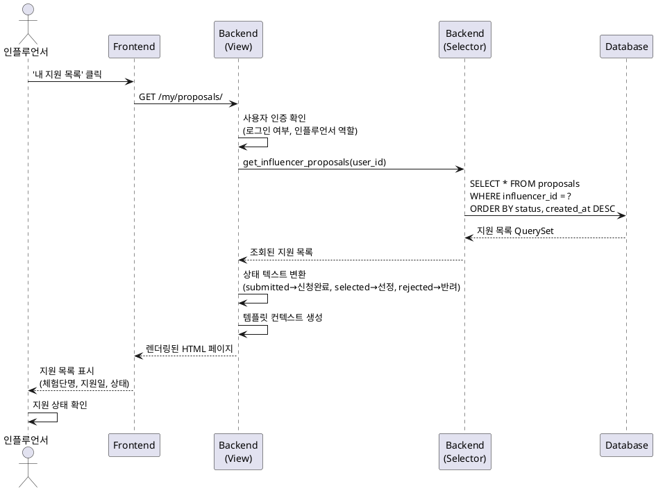

# 유스케이스 명세: 내 지원 목록 확인

## 유스케이스 ID: UC-003

### 제목
인플루언서의 체험단 지원 목록 조회 및 상태 확인

---

## 1. 개요

### 1.1 목적
인플루언서가 자신이 지원한 모든 체험단의 목록과 각 지원 건의 현재 상태(신청완료, 선정, 반려)를 한눈에 확인할 수 있도록 하여, 지원 현황을 투명하게 관리하고 선정 결과를 빠르게 파악할 수 있게 한다.

### 1.2 범위
- 로그인한 인플루언서 본인의 지원 내역만 조회 가능
- 지원 상태별 정렬 및 최신순 정렬 제공
- 각 지원 건에 대한 기본 정보(체험단명, 지원일, 상태) 표시
- 지원 내역이 없는 경우 빈 상태(Empty State) 처리

**제외 사항**:
- 다른 인플루언서의 지원 내역 조회
- 지원 건 수정 또는 취소 기능
- 실시간 알림 기능
- 상세 필터링 UI (MVP에서는 자동 정렬만 제공)

### 1.3 액터
- **주요 액터**: 인플루언서 (Influencer)
- **부 액터**: 없음

---

## 2. 선행 조건

- 사용자가 인플루언서 역할로 회원가입을 완료하고 로그인된 상태여야 한다.
- 사용자가 '내 지원 목록' 페이지에 접근할 수 있는 권한이 있어야 한다.

---

## 3. 참여 컴포넌트

- **프론트엔드 (FE)**: 지원 목록을 렌더링하는 사용자 인터페이스
  - 페이지 경로: `/my/proposals/`
  - 템플릿: `proposals/my_proposals_list.html`

- **백엔드 (BE)**: 지원 목록 조회 및 정렬 로직 처리
  - View: `apps/proposals/views.py - MyProposalsListView`
  - Selector: `apps/proposals/selectors/proposal_selectors.py - get_influencer_proposals()`

- **데이터베이스 (DB)**: 지원 정보 조회
  - 주요 테이블: `proposals`, `campaigns`, `users`
  - 조회 대상: 로그인한 인플루언서의 모든 지원 건

---

## 4. 기본 플로우 (Basic Flow)

### 4.1 단계별 흐름

1. **인플루언서**: '내 지원 목록' 메뉴 또는 버튼을 클릭하여 페이지 접근
   - 입력: 없음 (로그인 세션 정보만 사용)
   - 처리: 브라우저가 `/my/proposals/` URL로 GET 요청 전송
   - 출력: 없음

2. **프론트엔드**: 페이지 로드 요청을 백엔드로 전달
   - 입력: HTTP GET 요청
   - 처리: Django View가 요청을 수신
   - 출력: 없음

3. **백엔드 (View)**: 사용자 인증 및 권한 확인
   - 입력: `request.user`
   - 처리:
     - 사용자가 로그인되어 있는지 확인 (`@login_required`)
     - 사용자가 인플루언서 역할인지 확인 (`user.role == 'influencer'`)
   - 출력: 인증 성공 시 다음 단계 진행

4. **백엔드 (Selector)**: 지원 목록 조회
   - 입력: 현재 로그인한 인플루언서의 `user_id`
   - 처리:
     ```python
     # 의사코드
     proposals = Proposal.objects.filter(
         influencer_id=request.user.id
     ).select_related('campaign').order_by(
         'status',  # 상태별 정렬 (submitted, selected, rejected)
         '-created_at'  # 최신순 정렬
     )
     ```
   - 출력: 지원 목록 QuerySet

5. **백엔드 (View)**: 데이터 가공 및 템플릿 렌더링
   - 입력: 조회된 지원 목록 QuerySet
   - 처리:
     - 각 지원 건의 상태를 사용자 친화적인 텍스트로 변환 (submitted → 신청완료, selected → 선정, rejected → 반려)
     - 지원 내역이 없는 경우 빈 상태 플래그 설정
     - 템플릿 컨텍스트 생성
   - 출력: 렌더링된 HTML 페이지

6. **프론트엔드**: 페이지 렌더링 및 표시
   - 입력: 백엔드로부터 받은 HTML
   - 처리:
     - 지원 목록을 카드 또는 테이블 형태로 표시
     - 각 항목에 체험단명, 지원일, 현재 상태를 표시
     - 상태에 따라 색상 또는 아이콘 구분 (예: 신청완료-파랑, 선정-초록, 반려-회색)
   - 출력: 사용자에게 지원 목록 UI 노출

7. **인플루언서**: 지원 목록 확인 완료
   - 입력: 화면에 표시된 지원 목록
   - 처리: 각 지원 건의 상태를 시각적으로 확인
   - 출력: 사용자의 다음 액션 결정 (체험단 상세 확인, 다른 체험단 탐색 등)

### 4.2 시퀀스 다이어그램



---

## 5. 대안 플로우 (Alternative Flows)

### 5.1 대안 플로우 1: 지원 내역이 없는 경우

**시작 조건**: 단계 4 (백엔드 Selector 조회) 완료 후, 조회된 지원 목록이 비어있음

**단계**:
1. **백엔드 (Selector)**: 빈 QuerySet 반환
2. **백엔드 (View)**: 빈 상태 플래그 설정 (`has_proposals = False`)
3. **프론트엔드**: 빈 상태 UI 렌더링
   - 표시 메시지: "아직 지원한 체험단이 없습니다."
   - CTA 버튼: "체험단 둘러보기" (홈 페이지로 이동)

**결과**: 사용자에게 지원 내역이 없음을 명확히 전달하고, 체험단 탐색으로 유도

---

## 6. 예외 플로우 (Exception Flows)

### 6.1 예외 상황 1: 비로그인 사용자 접근

**발생 조건**: 로그인하지 않은 사용자가 `/my/proposals/` URL에 직접 접근

**처리 방법**:
1. **백엔드**: `@login_required` 데코레이터가 요청을 가로챔
2. **백엔드**: 로그인 페이지로 리디렉션
   - 리디렉션 URL: `/accounts/login/?next=/my/proposals/`
3. **프론트엔드**: 로그인 페이지 표시 및 로그인 후 원래 페이지로 복귀하도록 `next` 파라미터 활용

**에러 코드**: `302 Found` (리디렉션)

**사용자 메시지**: 로그인 페이지 상단에 "로그인이 필요한 서비스입니다." 안내 표시

### 6.2 예외 상황 2: 광고주 계정으로 접근

**발생 조건**: 광고주 역할의 사용자가 인플루언서 전용 페이지에 접근

**처리 방법**:
1. **백엔드 (View)**: 사용자 역할 확인 (`if request.user.role != 'influencer'`)
2. **백엔드**: 권한 없음 오류 반환
3. **프론트엔드**: 403 에러 페이지 표시

**에러 코드**: `403 Forbidden`

**사용자 메시지**: "접근 권한이 없습니다. 인플루언서 계정으로 로그인해주세요."

### 6.3 예외 상황 3: 데이터베이스 조회 오류

**발생 조건**: 데이터베이스 연결 실패 또는 쿼리 실행 중 예외 발생

**처리 방법**:
1. **백엔드 (Selector)**: 예외 발생 시 로그 기록 및 빈 리스트 반환
2. **백엔드 (View)**: 에러 플래그 설정 및 안내 메시지 전달
3. **프론트엔드**: 일시적 오류 안내 UI 표시

**에러 코드**: `500 Internal Server Error`

**사용자 메시지**: "일시적인 오류가 발생했습니다. 잠시 후 다시 시도해주세요."

---

## 7. 후행 조건 (Post-conditions)

### 7.1 성공 시

- **데이터베이스 변경**: 없음 (읽기 전용 작업)
- **시스템 상태**: 변경 없음
- **사용자 경험**:
  - 사용자는 자신의 모든 지원 내역을 상태별로 정렬된 목록으로 확인
  - 각 지원 건의 현재 상태를 명확히 인지
  - 선정된 체험단이 있는 경우 해당 정보를 우선적으로 확인 가능

### 7.2 실패 시

- **데이터 롤백**: 해당 없음 (읽기 작업)
- **시스템 상태**: 변경 없음
- **사용자 경험**:
  - 권한 없음 또는 로그인 필요 메시지 표시
  - 로그인 페이지로 리디렉션되거나 홈으로 복귀

---

## 8. 비즈니스 규칙 (Business Rules)

### BR-001: 본인 데이터만 조회 가능
- 인플루언서는 자신이 지원한 체험단 목록만 조회할 수 있다.
- 다른 인플루언서의 지원 내역은 절대 노출되지 않는다.

### BR-002: 상태별 자동 정렬
- 지원 목록은 상태(신청완료, 선정, 반려) 순서로 자동 정렬된다.
- 동일 상태 내에서는 최신순(created_at DESC)으로 정렬된다.
- 정렬 순서:
  1. 신청완료 (submitted) - 아직 결과가 나오지 않은 건
  2. 선정 (selected) - 선정된 건
  3. 반려 (rejected) - 반려된 건

### BR-003: 빈 상태 처리
- 지원 내역이 없는 경우, 빈 리스트 대신 명확한 안내 메시지와 CTA를 제공한다.

### BR-004: 읽기 전용
- 이 페이지는 조회 전용이며, 지원 건의 수정이나 삭제는 지원하지 않는다. (MVP 범위)

---

## 9. 비기능 요구사항

### 9.1 성능
- **응답 시간**: 페이지 로드 시간 2초 이내 (일반적인 네트워크 환경 기준)
- **처리량**: 동시 접속자 100명까지 안정적 처리 (MVP 목표)
- **최적화**:
  - `select_related('campaign')` 사용하여 N+1 쿼리 문제 방지
  - 인덱스 활용: `proposals` 테이블의 `influencer_id`, `status`, `created_at` 컬럼

### 9.2 보안
- **인증**: Django 세션 기반 인증 (`@login_required`)
- **권한**: 인플루언서 역할 체크 (`role == 'influencer'`)
- **데이터 격리**: 본인의 데이터만 조회 가능하도록 필터링 (`filter(influencer_id=request.user.id)`)

### 9.3 가용성
- **목표**: 99% 가동률 (MVP 기준)
- **장애 처리**: DB 조회 실패 시 빈 상태 또는 오류 안내 표시

---

## 10. UI/UX 요구사항

### 10.1 화면 구성

**페이지 제목**: "내 지원 목록"

**주요 UI 요소**:
1. **헤더**
   - 페이지 제목: "내 지원 목록"
   - 전체 지원 건수 표시: "총 N건"

2. **지원 목록 (카드 또는 테이블 형태)**
   - 각 항목 표시 정보:
     - 체험단명 (Campaign.name)
     - 지원일 (Proposal.created_at, 형식: YYYY년 MM월 DD일)
     - 방문 희망일 (Proposal.desired_visit_date)
     - 현재 상태 (Proposal.status)
       - 신청완료: 파란색 배지
       - 선정: 초록색 배지
       - 반려: 회색 배지
   - 클릭 시 해당 체험단 상세 페이지로 이동

3. **빈 상태 (Empty State)**
   - 아이콘: 빈 리스트 또는 돋보기 아이콘
   - 메시지: "아직 지원한 체험단이 없습니다."
   - CTA 버튼: "체험단 둘러보기" (홈 페이지로 이동)

### 10.2 사용자 경험

- **정렬 우선순위**: 선정된 체험단이 있는 경우 상단에 노출되어 사용자가 즉시 확인 가능
- **시각적 구분**: 상태별로 색상 코드를 사용하여 한눈에 상태 파악 가능
- **반응형 디자인**: 모바일 환경에서도 목록이 깔끔하게 표시
- **로딩 상태**: 데이터 조회 중 로딩 스피너 표시

---

## 11. 테스트 시나리오

### 11.1 성공 케이스

| 테스트 케이스 ID | 선행 조건 | 테스트 단계 | 기대 결과 |
|----------------|----------|-----------|----------|
| TC-003-01 | 인플루언서로 로그인, 지원 내역 3건 존재 (신청완료 1건, 선정 1건, 반려 1건) | 1. '내 지원 목록' 페이지 접근<br>2. 목록 확인 | 3건 모두 표시되며, 신청완료 → 선정 → 반려 순서로 정렬됨 |
| TC-003-02 | 인플루언서로 로그인, 지원 내역 없음 | 1. '내 지원 목록' 페이지 접근 | 빈 상태 UI 표시: "아직 지원한 체험단이 없습니다." 및 "체험단 둘러보기" 버튼 노출 |
| TC-003-03 | 인플루언서로 로그인, 동일 상태 지원 건 5건 (모두 신청완료) | 1. '내 지원 목록' 페이지 접근 | 5건 모두 표시되며, 최신순으로 정렬됨 (created_at DESC) |

### 11.2 실패 케이스

| 테스트 케이스 ID | 선행 조건 | 테스트 단계 | 기대 결과 |
|----------------|----------|-----------|----------|
| TC-003-04 | 비로그인 상태 | 1. `/my/proposals/` URL 직접 접근 | 로그인 페이지로 리디렉션, `?next=/my/proposals/` 파라미터 포함 |
| TC-003-05 | 광고주로 로그인 | 1. '내 지원 목록' 페이지 접근 시도 | 403 Forbidden 페이지 표시: "접근 권한이 없습니다. 인플루언서 계정으로 로그인해주세요." |
| TC-003-06 | 인플루언서로 로그인, DB 연결 실패 시뮬레이션 | 1. '내 지원 목록' 페이지 접근 | 500 에러 페이지 또는 "일시적인 오류가 발생했습니다." 메시지 표시 |

---

## 12. 관련 유스케이스

- **선행 유스케이스**:
  - UC-001: 인플루언서 회원가입 및 온보딩
  - UC-002: 체험단 지원

- **후행 유스케이스**:
  - 체험단 상세 페이지 조회 (지원 목록에서 특정 체험단 클릭 시)
  - 선정된 체험단 활동 관리 (MVP 범위 외, 향후 확장)

- **연관 유스케이스**:
  - UC-007: 광고주의 체험단 선정 (인플루언서의 지원 상태가 '선정'으로 변경되는 트리거)

---

## 13. 데이터베이스 영향

### 13.1 조회 테이블
- **proposals**: 인플루언서의 지원 정보
- **campaigns**: 지원한 체험단의 기본 정보 (체험단명 등)
- **users**: 현재 로그인한 사용자 정보 (인증 및 권한 확인)

### 13.2 주요 쿼리
```sql
SELECT
    p.id,
    p.campaign_id,
    p.status,
    p.created_at,
    p.desired_visit_date,
    c.name AS campaign_name
FROM proposals p
INNER JOIN campaigns c ON p.campaign_id = c.id
WHERE p.influencer_id = :user_id
ORDER BY
    CASE p.status
        WHEN 'submitted' THEN 1
        WHEN 'selected' THEN 2
        WHEN 'rejected' THEN 3
    END,
    p.created_at DESC;
```

### 13.3 필요 인덱스
- `proposals.influencer_id` (기존 인덱스 활용)
- `proposals.status` (정렬 성능 향상)
- `proposals.created_at` (정렬 성능 향상)

---

## 14. 변경 이력

| 버전 | 날짜 | 작성자 | 변경 내용 |
|------|------|--------|-----------|
| 1.0  | 2025-11-16 | Claude | 초기 작성 (userflow.md 1.3 기반) |

---

## 부록

### A. 용어 정의

- **지원 (Proposal)**: 인플루언서가 특정 체험단에 참여하기 위해 제출한 신청 건
- **신청완료 (Submitted)**: 지원이 제출되었으나 아직 광고주의 선정 결과가 나오지 않은 상태
- **선정 (Selected)**: 광고주가 해당 인플루언서를 체험단 참여자로 선정한 상태
- **반려 (Rejected)**: 광고주가 해당 인플루언서를 체험단 참여자로 선정하지 않은 상태
- **빈 상태 (Empty State)**: 조회 결과가 없을 때 사용자에게 보여지는 안내 UI

### B. 참고 자료

- `/docs/userflow.md` - 섹션 1.3: 내 지원 목록 확인
- `/docs/database.md` - proposals 테이블 스키마
- `/docs/structure.md` - 코드베이스 구조 및 Layered Architecture
- `/docs/prd.md` - 섹션 5: 내 지원 목록 페이지 명세
