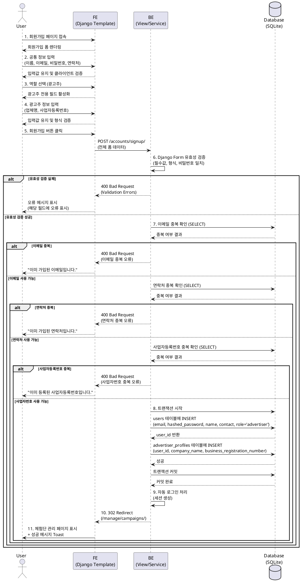

# 유스케이스 명세서

## 유스케이스 ID: UC-004

### 제목
광고주 회원가입 및 온보딩

---

## 1. 개요

### 1.1 목적
체험단 매칭 플랫폼에 광고주로 가입하여, 체험단을 등록하고 관리할 수 있는 계정을 생성한다.

### 1.2 범위
- 광고주 역할 선택 및 기본 정보 입력
- 광고주 전용 추가 정보(업체명, 사업자등록번호) 입력
- 회원가입 성공 후 자동 로그인 처리
- 체험단 관리 대시보드로의 리디렉션

**범위 외:**
- 이메일 인증 프로세스 (MVP 단계 제외)
- 사업자등록번호 실제 검증 (형식 검증만 수행)
- 소셜 로그인 (MVP 단계 제외)

### 1.3 액터
- **주요 액터**: 광고주 (Advertiser) - 오프라인 매장 운영자, 브랜드 운영자, 중소기업 마케터
- **부 액터**: 시스템 (Backend Server, Database)

---

## 2. 선행 조건

- 사용자가 회원가입 페이지에 접속할 수 있어야 한다.
- 사용자가 로그인하지 않은 상태여야 한다.
- 시스템이 정상 작동 중이어야 한다.

---

## 3. 참여 컴포넌트

- **Frontend (Django Template)**: 회원가입 폼 렌더링 및 사용자 입력 수집
- **Backend (Django Views)**: HTTP 요청 처리 및 오케스트레이션
- **Service Layer**: 회원가입 비즈니스 로직 처리
- **Database (SQLite)**: 사용자 계정 및 프로필 데이터 저장
  - `users` 테이블: 공통 사용자 정보 저장
  - `advertiser_profiles` 테이블: 광고주 전용 정보 저장

---

## 4. 기본 플로우 (Basic Flow)

### 4.1 단계별 흐름

1. **사용자**: 회원가입 페이지 접속
   - 입력: `/accounts/signup/` URL 접속
   - 처리: Frontend가 회원가입 폼 렌더링
   - 출력: 회원가입 폼 화면 표시

2. **사용자**: 공통 정보 입력
   - 입력:
     - 이름 (name)
     - 이메일 (email)
     - 비밀번호 (password)
     - 비밀번호 확인 (password_confirm)
     - 연락처 (contact)
     - 약관 동의 체크박스
   - 처리: Frontend에서 기본 클라이언트 측 유효성 검증
   - 출력: 입력값이 폼에 유지됨

3. **사용자**: 역할 선택
   - 입력: '광고주' 라디오 버튼 선택
   - 처리: Frontend에서 광고주 전용 입력 필드 표시
   - 출력: 업체명, 사업자등록번호 입력 필드 활성화

4. **사용자**: 광고주 전용 정보 입력
   - 입력:
     - 업체명 (company_name)
     - 사업자등록번호 (business_registration_number) - 형식: XXX-XX-XXXXX
   - 처리: Frontend에서 사업자등록번호 형식 클라이언트 측 검증
   - 출력: 입력값 유지 및 형식 오류 시 즉시 피드백

5. **사용자**: 회원가입 제출
   - 입력: '회원가입' 버튼 클릭
   - 처리: Frontend가 POST 요청으로 모든 입력값 전송
   - 출력: 서버로 데이터 전송

6. **Backend (View)**: 요청 수신 및 1차 검증
   - 입력: POST 요청 데이터
   - 처리:
     - Django Form을 통한 입력값 유효성 검증
     - 필수 필드 존재 여부 확인
     - 이메일 형식 검증
     - 비밀번호 일치 여부 확인
     - 연락처 형식 검증
     - 사업자등록번호 형식 검증 (정규표현식)
   - 출력: 유효한 cleaned_data 또는 validation errors

7. **Backend (Service)**: 중복 확인
   - 입력: cleaned_data
   - 처리:
     - 이메일 중복 확인 (users 테이블 조회)
     - 연락처 중복 확인 (users 테이블 조회)
     - 사업자등록번호 중복 확인 (advertiser_profiles 테이블 조회)
   - 출력: 중복 여부 결과

8. **Backend (Service)**: 계정 생성 (트랜잭션)
   - 입력: 검증된 사용자 정보
   - 처리:
     - `users` 테이블에 레코드 생성
       - email, name, contact 저장
       - password는 Django의 해싱 함수로 암호화하여 저장
       - role = 'advertiser' 설정
     - `advertiser_profiles` 테이블에 레코드 생성
       - user_id = 생성된 user의 id
       - company_name 저장
       - business_registration_number 저장
   - 출력: 생성된 User 객체

9. **Backend (View)**: 자동 로그인 처리
   - 입력: 생성된 User 객체
   - 처리: Django 인증 시스템을 통한 세션 생성 (login 함수 호출)
   - 출력: 로그인 세션 활성화

10. **Backend (View)**: 리디렉션
    - 입력: 로그인된 사용자 세션
    - 처리: `/manage/campaigns/` (체험단 관리 대시보드)로 리디렉션
    - 출력: HTTP 302 Redirect 응답

11. **Frontend**: 성공 피드백 표시
    - 입력: 체험단 관리 페이지 로드
    - 처리: 회원가입 성공 메시지를 Toast 또는 Alert 형태로 표시
    - 출력: "회원가입이 완료되었습니다." 메시지

### 4.2 시퀀스 다이어그램

---

## 5. 대안 플로우 (Alternative Flows)

### 5.1 대안 플로우 1: 가입 절차 중 이탈

**시작 조건**: 사용자가 폼 작성 중 페이지 이탈

**단계**:
1. 사용자가 폼을 완성하지 않고 브라우저를 닫거나 다른 페이지로 이동
2. 시스템은 입력된 정보를 저장하지 않음
3. 다음 회원가입 시도 시 모든 필드가 비어있는 상태로 시작

**결과**: 데이터베이스에 아무런 변경 없음

### 5.2 대안 플로우 2: 약관 미동의

**시작 조건**: 사용자가 필수 약관에 동의하지 않고 제출 시도

**단계**:
1. 사용자가 약관 동의 체크박스를 선택하지 않음
2. '회원가입' 버튼 클릭
3. Frontend에서 클라이언트 측 검증으로 제출 차단
4. 약관 동의 체크박스에 오류 메시지 표시

**결과**: 폼 제출이 차단되며, 사용자에게 약관 동의 필요성 안내

---

## 6. 예외 플로우 (Exception Flows)

### 6.1 예외 상황 1: 이메일 중복

**발생 조건**: 입력한 이메일이 이미 시스템에 등록되어 있는 경우

**처리 방법**:
1. Service 계층에서 이메일 중복 확인 시 중복 감지
2. View 계층으로 ValidationError 반환
3. Frontend에서 이메일 필드에 오류 표시

**에러 코드**: HTTP 400 Bad Request

**사용자 메시지**: "이미 가입된 이메일입니다. 다른 이메일을 사용해주세요."

---

### 6.2 예외 상황 2: 연락처 중복

**발생 조건**: 입력한 연락처가 이미 시스템에 등록되어 있는 경우

**처리 방법**:
1. Service 계층에서 연락처 중복 확인 시 중복 감지
2. View 계층으로 ValidationError 반환
3. Frontend에서 연락처 필드에 오류 표시

**에러 코드**: HTTP 400 Bad Request

**사용자 메시지**: "이미 가입된 연락처입니다. 다른 연락처를 사용해주세요."

---

### 6.3 예외 상황 3: 사업자등록번호 중복

**발생 조건**: 입력한 사업자등록번호가 이미 시스템에 등록되어 있는 경우

**처리 방법**:
1. Service 계층에서 사업자등록번호 중복 확인 시 중복 감지
2. View 계층으로 ValidationError 반환
3. Frontend에서 사업자등록번호 필드에 오류 표시

**에러 코드**: HTTP 400 Bad Request

**사용자 메시지**: "이미 등록된 사업자등록번호입니다. 확인 후 다시 시도해주세요."

---

### 6.4 예외 상황 4: 사업자등록번호 형식 오류

**발생 조건**: 입력한 사업자등록번호가 올바른 형식(XXX-XX-XXXXX)이 아닌 경우

**처리 방법**:
1. Django Form 유효성 검증에서 형식 오류 감지
2. View 계층에서 ValidationError 처리
3. Frontend에서 사업자등록번호 필드에 오류 표시

**에러 코드**: HTTP 400 Bad Request

**사용자 메시지**: "올바른 사업자등록번호 형식이 아닙니다. (예: 123-45-67890)"

---

### 6.5 예외 상황 5: 비밀번호 불일치

**발생 조건**: 비밀번호와 비밀번호 확인 필드의 값이 일치하지 않는 경우

**처리 방법**:
1. Django Form 유효성 검증에서 불일치 감지
2. View 계층에서 ValidationError 처리
3. Frontend에서 비밀번호 확인 필드에 오류 표시

**에러 코드**: HTTP 400 Bad Request

**사용자 메시지**: "비밀번호가 일치하지 않습니다."

---

### 6.6 예외 상황 6: 필수 필드 누락

**발생 조건**: 필수 입력 필드 중 하나라도 비어있는 경우

**처리 방법**:
1. Django Form 유효성 검증에서 필수값 누락 감지
2. View 계층에서 ValidationError 처리
3. Frontend에서 해당 필드에 오류 표시

**에러 코드**: HTTP 400 Bad Request

**사용자 메시지**: "필수 입력 항목입니다."

---

### 6.7 예외 상황 7: 데이터베이스 트랜잭션 실패

**발생 조건**: users 테이블에는 성공했으나 advertiser_profiles 테이블 INSERT 실패

**처리 방법**:
1. Service 계층에서 트랜잭션 롤백 수행
2. 생성된 모든 데이터 되돌림
3. View 계층으로 Internal Server Error 반환
4. Frontend에서 일반 오류 메시지 표시

**에러 코드**: HTTP 500 Internal Server Error

**사용자 메시지**: "회원가입 처리 중 오류가 발생했습니다. 잠시 후 다시 시도해주세요."

---

### 6.8 예외 상황 8: 이미 로그인한 사용자의 접근

**발생 조건**: 이미 로그인한 상태에서 회원가입 페이지 접근 시도

**처리 방법**:
1. View 계층에서 로그인 상태 확인
2. 로그인 상태일 경우 홈 페이지로 리디렉션

**에러 코드**: HTTP 302 Redirect

**사용자 메시지**: (리디렉션만 수행, 별도 메시지 없음)

---

## 7. 후행 조건 (Post-conditions)

### 7.1 성공 시

**데이터베이스 변경**:
- `users` 테이블에 신규 레코드 1건 추가
  - `email`: 입력된 이메일
  - `password`: 해싱된 비밀번호
  - `name`: 입력된 이름
  - `contact`: 입력된 연락처
  - `role`: 'advertiser'
  - `created_at`: 현재 시각
  - `updated_at`: 현재 시각

- `advertiser_profiles` 테이블에 신규 레코드 1건 추가
  - `user_id`: 생성된 users 테이블의 id (Foreign Key)
  - `company_name`: 입력된 업체명
  - `business_registration_number`: 입력된 사업자등록번호

**시스템 상태**:
- 사용자가 로그인된 상태로 전환
- Django 세션에 사용자 인증 정보 저장
- 광고주 권한 활성화

**외부 시스템**:
- (MVP 단계에서는 없음. 향후 이메일 발송, 마케팅 툴 연동 등 가능)

### 7.2 실패 시

**데이터 롤백**:
- 트랜잭션 실패 시 모든 데이터베이스 변경사항 롤백
- `users` 테이블과 `advertiser_profiles` 테이블 모두 변경 없음

**시스템 상태**:
- 사용자는 비로그인 상태 유지
- 회원가입 폼 화면에 머무르며 오류 메시지 표시
- 입력된 데이터는 비밀번호를 제외하고 유지 (재입력 편의성)

---

## 8. 비즈니스 규칙 (Business Rules)

### BR-001: 역할 선택 제한
- 회원가입 시 반드시 '광고주' 또는 '인플루언서' 중 하나의 역할을 선택해야 한다.
- 한 이메일 계정으로 두 역할을 동시에 가질 수 없다.

### BR-002: 이메일 유일성
- 시스템 내에서 이메일은 고유해야 하며, 중복된 이메일로는 가입할 수 없다.

### BR-003: 연락처 유일성
- 시스템 내에서 연락처는 고유해야 하며, 중복된 연락처로는 가입할 수 없다.

### BR-004: 사업자등록번호 유일성
- 시스템 내에서 사업자등록번호는 고유해야 하며, 중복된 번호로는 가입할 수 없다.

### BR-005: 사업자등록번호 형식
- 사업자등록번호는 `XXX-XX-XXXXX` 형식을 따라야 한다. (총 10자리, 하이픈 포함 12자)
- MVP 단계에서는 형식 검증만 수행하며, 국세청 API를 통한 실제 사업자번호 유효성 검증은 수행하지 않는다.

### BR-006: 비밀번호 보안
- 비밀번호는 평문으로 저장되지 않으며, Django의 기본 해싱 알고리즘(PBKDF2)을 사용하여 암호화된다.
- 비밀번호와 비밀번호 확인 필드의 값은 반드시 일치해야 한다.

### BR-007: 자동 로그인
- 회원가입 성공 시 별도의 로그인 절차 없이 자동으로 로그인 상태로 전환된다.

### BR-008: 약관 동의 필수
- 회원가입을 위해서는 서비스 이용약관 및 개인정보 처리방침에 동의해야 한다.

---

## 9. 비기능 요구사항

### 9.1 성능
- 회원가입 처리는 3초 이내에 완료되어야 한다.
- 이메일/연락처/사업자등록번호 중복 확인 쿼리는 각각 100ms 이내에 완료되어야 한다.
- 동시 회원가입 요청 처리: 최소 10명의 동시 가입 요청을 처리할 수 있어야 한다. (MVP 베타테스트 규모)

### 9.2 보안
- 비밀번호는 Django의 기본 해싱 알고리즘(PBKDF2_SHA256)을 사용하여 암호화 저장
- HTTPS 통신 사용 (Railway 배포 시 기본 제공)
- CSRF 토큰을 통한 폼 제출 보호
- SQL Injection 방지 (Django ORM 사용)
- XSS 방지 (Django Template의 자동 이스케이핑)

### 9.3 가용성
- MVP 단계에서는 베타테스트 시간(평일 오전 9시 - 오후 6시) 동안 95% 이상 가용성 목표
- 시스템 장애 시 복구 시간: 1시간 이내 (Railway의 자동 재시작 활용)

### 9.4 데이터 무결성
- 트랜잭션을 사용하여 users와 advertiser_profiles 테이블의 데이터 일관성 보장
- Foreign Key 제약조건을 통한 참조 무결성 보장

---

## 10. UI/UX 요구사항

### 10.1 화면 구성

**레이아웃**:
- 중앙 정렬된 회원가입 폼 (최대 너비 500px)
- 상단에 로고 및 "회원가입" 제목
- 하단에 "이미 계정이 있으신가요? 로그인" 링크

**필수 UI 요소**:
1. 이름 입력 필드 (text input)
2. 이메일 입력 필드 (email input)
3. 비밀번호 입력 필드 (password input)
4. 비밀번호 확인 입력 필드 (password input)
5. 연락처 입력 필드 (tel input) - 형식 가이드: 010-1234-5678
6. 역할 선택 라디오 버튼 (광고주 / 인플루언서)
7. 업체명 입력 필드 (text input) - 광고주 선택 시 표시
8. 사업자등록번호 입력 필드 (text input) - 광고주 선택 시 표시, 형식 가이드: 123-45-67890
9. 약관 동의 체크박스 (필수)
10. 회원가입 버튼 (primary button)

**필드 배치 순서**:
1. 이름
2. 이메일
3. 비밀번호
4. 비밀번호 확인
5. 연락처
6. 역할 선택
7. 업체명 (조건부 표시)
8. 사업자등록번호 (조건부 표시)
9. 약관 동의
10. 회원가입 버튼

### 10.2 사용자 경험

**즉시 피드백**:
- 각 필드 입력 시 형식 검증 결과를 실시간으로 표시
- 사업자등록번호 입력 시 자동으로 하이픈 삽입 (UX 편의성)
- 오류 메시지는 해당 필드 하단에 빨간색으로 표시

**인터랙션**:
- '광고주' 라디오 버튼 선택 시 부드러운 애니메이션으로 추가 필드 표시
- '인플루언서' 선택 시 광고주 전용 필드는 숨김 처리
- 회원가입 버튼 클릭 시 로딩 상태 표시 (버튼 비활성화 + 스피너)

**접근성**:
- 모든 입력 필드에 명확한 label 제공
- placeholder를 통한 입력 예시 제공
- 오류 발생 시 해당 필드로 자동 포커스 이동
- 키보드 내비게이션 지원 (Tab 키로 필드 간 이동)

**반응형 디자인**:
- 모바일 화면에서도 모든 필드가 편안하게 입력 가능하도록 최적화
- 터치 영역 최소 44x44px 확보

---

## 11. 테스트 시나리오

### 11.1 성공 케이스

| 테스트 케이스 ID | 입력값 | 기대 결과 |
|----------------|--------|----------|
| TC-004-01 | 유효한 모든 필드 입력 (광고주) | 회원가입 성공, 자동 로그인, 체험단 관리 페이지로 이동 |
| TC-004-02 | 최소 길이 이름 (2자) | 회원가입 성공 |
| TC-004-03 | 최대 길이 이름 (100자) | 회원가입 성공 |
| TC-004-04 | 유효한 이메일 형식 (예: user@example.com) | 회원가입 성공 |
| TC-004-05 | 유효한 사업자등록번호 형식 | 회원가입 성공, advertiser_profiles에 저장 확인 |

### 11.2 실패 케이스

| 테스트 케이스 ID | 입력값 | 기대 결과 |
|----------------|--------|----------|
| TC-004-06 | 이메일 필드 공백 | "필수 입력 항목입니다." 오류 메시지 |
| TC-004-07 | 유효하지 않은 이메일 형식 (예: user@) | "올바른 이메일 형식이 아닙니다." 오류 메시지 |
| TC-004-08 | 비밀번호와 비밀번호 확인 불일치 | "비밀번호가 일치하지 않습니다." 오류 메시지 |
| TC-004-09 | 이미 가입된 이메일 | "이미 가입된 이메일입니다." 오류 메시지 |
| TC-004-10 | 이미 가입된 연락처 | "이미 가입된 연락처입니다." 오류 메시지 |
| TC-004-11 | 이미 등록된 사업자등록번호 | "이미 등록된 사업자등록번호입니다." 오류 메시지 |
| TC-004-12 | 잘못된 사업자등록번호 형식 (예: 12345) | "올바른 사업자등록번호 형식이 아닙니다." 오류 메시지 |
| TC-004-13 | 약관 미동의 상태로 제출 | 폼 제출 차단, 약관 동의 필요 메시지 |
| TC-004-14 | 업체명 필드 공백 (광고주 선택 시) | "필수 입력 항목입니다." 오류 메시지 |
| TC-004-15 | 역할 미선택 | "역할을 선택해주세요." 오류 메시지 |

### 11.3 Edge 케이스

| 테스트 케이스 ID | 입력값 | 기대 결과 |
|----------------|--------|----------|
| TC-004-16 | 특수문자가 포함된 이름 | 입력 허용 및 저장 확인 |
| TC-004-17 | 공백이 포함된 업체명 | 정상 저장 확인 |
| TC-004-18 | 폼 작성 중 페이지 이탈 후 재접속 | 빈 폼 상태로 시작 |
| TC-004-19 | 로그인 상태에서 회원가입 페이지 접근 | 홈 페이지로 자동 리디렉션 |
| TC-004-20 | 동시에 같은 이메일로 2번 가입 시도 | 한 건만 성공, 다른 건은 중복 오류 |

---

## 12. 관련 유스케이스

### 선행 유스케이스
- 없음 (첫 진입 기능)

### 후행 유스케이스
- **UC-005**: 신규 체험단 등록 (광고주 회원가입 후 첫 활동)
- **UC-006**: 로그인 (재방문 시)

### 연관 유스케이스
- **UC-001**: 인플루언서 회원가입 및 온보딩 (다른 역할의 회원가입)
- **UC-007**: 로그아웃

---

## 13. 변경 이력

| 버전 | 날짜 | 작성자 | 변경 내용 |
|------|------|--------|-----------|
| 1.0  | 2025-11-16 | Claude | 초기 작성 - userflow.md "2.1. 회원가입 및 온보딩 (광고주)" 기반 상세 유스케이스 명세 |

---

## 부록

### A. 용어 정의

- **광고주 (Advertiser)**: 체험단 매칭 플랫폼에서 체험단을 등록하고 관리하는 사업자 역할
- **인플루언서 (Influencer)**: 체험단에 지원하고 참여하는 SNS 채널 운영자 역할
- **사업자등록번호**: 한국의 사업자를 식별하는 고유 번호 (형식: XXX-XX-XXXXX)
- **해싱 (Hashing)**: 비밀번호를 암호화하여 원본을 복원할 수 없도록 변환하는 단방향 암호화 기법
- **트랜잭션 (Transaction)**: 여러 데이터베이스 작업을 하나의 원자적 단위로 묶어 모두 성공하거나 모두 실패하도록 보장하는 메커니즘

### B. 참고 자료

- `/docs/requirement.md`: 프로젝트 전체 요구사항
- `/docs/userflow.md`: 기능별 사용자 플로우 명세
- `/docs/database.md`: 데이터베이스 스키마 정의
- `/docs/prd.md`: 제품 요구사항 명세서
- Django Authentication Documentation: https://docs.djangoproject.com/en/stable/topics/auth/
- Django Form Validation: https://docs.djangoproject.com/en/stable/ref/forms/validation/
