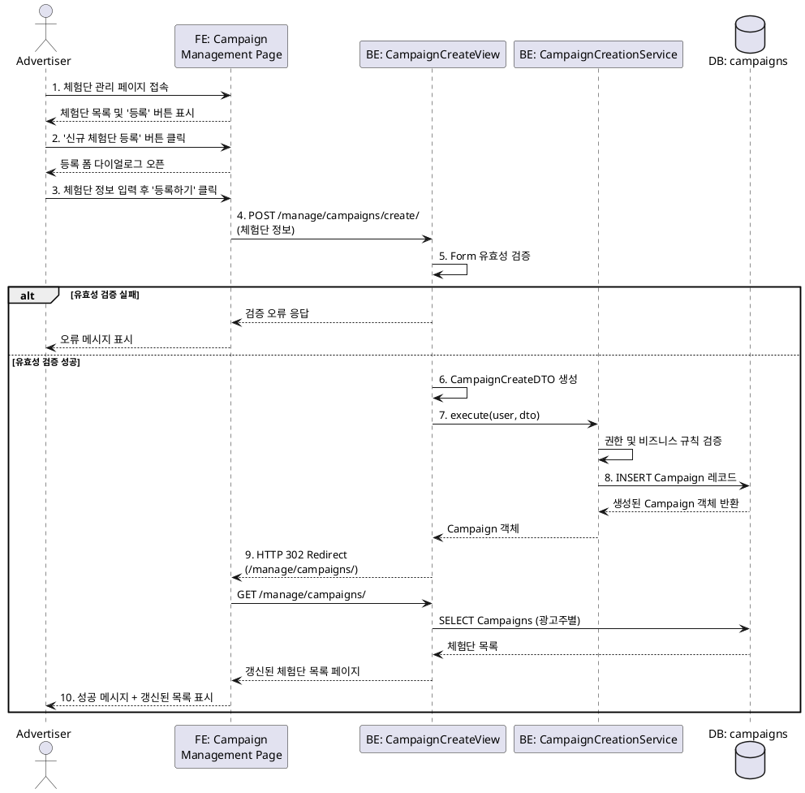

# 유스케이스 ID: UC-005

## 제목
광고주의 신규 체험단 등록

---

## 1. 개요

### 1.1 목적
광고주가 자신의 제품 및 서비스를 홍보하기 위해 새로운 체험단 캠페인을 생성하고, 인플루언서의 지원을 받을 수 있도록 모집 정보를 시스템에 등록하는 기능을 제공한다.

### 1.2 범위
- 체험단 기본 정보(체험단명, 모집 기간, 인원, 혜택, 미션) 입력 및 등록
- 등록된 체험단의 초기 상태는 '모집 중(recruiting)'으로 설정
- 등록 즉시 홈 페이지에서 인플루언서들이 체험단을 확인할 수 있도록 노출

**범위 외:**
- 이미지 업로드 기능 (MVP 단계 제외)
- 체험단 수정/삭제 기능 (별도 유스케이스)
- 임시저장 기능

### 1.3 액터
- **주요 액터**: 광고주 (Advertiser)
- **부 액터**: 시스템, 데이터베이스

---

## 2. 선행 조건

- 사용자가 광고주(Advertiser) 역할로 회원가입 및 로그인이 완료된 상태
- 광고주 프로필(업체명, 사업자등록번호 등)이 정상적으로 등록되어 있어야 함
- '체험단 관리' 페이지(`/manage/campaigns/`)에 접근 가능한 상태

---

## 3. 참여 컴포넌트

- **프론트엔드(FE)**: 체험단 관리 페이지, 신규 체험단 등록 다이얼로그 폼
- **백엔드(BE)**:
  - `apps/campaigns/views.py` - 체험단 등록 View
  - `apps/campaigns/forms.py` - 체험단 등록 Form
  - `apps/campaigns/services/campaign_creation.py` - 체험단 생성 비즈니스 로직
  - `apps/campaigns/dto.py` - 데이터 전송 객체
- **데이터베이스(DB)**: `campaigns` 테이블

---

## 4. 기본 플로우 (Basic Flow)

### 4.1 단계별 흐름

1. **[광고주]**: 체험단 관리 페이지(`/manage/campaigns/`)에 접속
   - 입력: 없음
   - 처리: 페이지 로드
   - 출력: 기존 등록 체험단 목록 및 '신규 체험단 등록' 버튼 노출

2. **[광고주]**: '신규 체험단 등록' 버튼 클릭
   - 입력: 버튼 클릭 이벤트
   - 처리: 다이얼로그 폼 표시
   - 출력: 체험단 등록 폼 다이얼로그 오픈

3. **[광고주]**: 체험단 정보 입력 및 제출
   - 입력:
     - 체험단명 (name) - 필수, 최대 255자
     - 모집 시작일 (recruitment_start_date) - 필수, Date 형식
     - 모집 종료일 (recruitment_end_date) - 필수, Date 형식
     - 모집 인원 (recruitment_count) - 필수, 양의 정수
     - 제공 혜택 (benefits) - 필수, 텍스트
     - 미션 (mission) - 필수, 텍스트
   - 처리: 프론트엔드에서 기본적인 필드 검증 후 서버로 POST 요청 전송
   - 출력: 서버로 HTTP POST 요청

4. **[BE - View]**: HTTP 요청 수신 및 Form 검증
   - 입력: POST 요청 데이터
   - 처리:
     - `CampaignCreateForm`을 통한 유효성 검증
     - CSRF 토큰 검증
     - 필수 필드 누락 여부 확인
     - 날짜 형식 및 논리적 유효성 확인
   - 출력: 검증된 `cleaned_data` 또는 검증 오류

5. **[BE - View]**: DTO 생성 및 서비스 계층 호출
   - 입력: `form.cleaned_data`
   - 처리:
     - `CampaignCreateDTO` 객체 생성
     - `CampaignCreationService.execute()` 호출
   - 출력: DTO 객체

6. **[BE - Service]**: 비즈니스 로직 실행
   - 입력: `user` 객체, `CampaignCreateDTO` 객체
   - 처리:
     - 권한 확인 (user.role == 'advertiser')
     - 비즈니스 규칙 검증 (모집 종료일 >= 모집 시작일)
     - Campaign 모델 객체 생성 준비
   - 출력: 검증 통과 또는 예외 발생

7. **[BE - Database]**: 데이터 저장
   - 입력: Campaign 모델 인스턴스
   - 처리:
     - `campaigns` 테이블에 새로운 레코드 INSERT
     - `advertiser_id`: 현재 로그인한 광고주의 user ID
     - `status`: 'recruiting' (기본값)
     - `created_at`, `updated_at`: 현재 시각
   - 출력: 생성된 Campaign 객체 (PK 포함)

8. **[BE - View]**: 성공 응답 반환
   - 입력: 생성된 Campaign 객체
   - 처리: 성공 메시지와 함께 체험단 관리 페이지로 리디렉션 URL 생성
   - 출력: HTTP 302 Redirect 응답 (`/manage/campaigns/`)

9. **[FE]**: 리디렉션 및 성공 피드백 표시
   - 입력: HTTP 302 응답
   - 처리: 체험단 관리 페이지로 리디렉션, 다이얼로그 닫기
   - 출력:
     - 갱신된 체험단 목록 (방금 등록한 체험단 포함)
     - "체험단이 성공적으로 등록되었습니다." 성공 메시지 토스트/알림

### 4.2 시퀀스 다이어그램

---

## 5. 대안 플로우 (Alternative Flows)

### 5.1 대안 플로우 1: 유효성 검증 실패

**시작 조건**: 기본 플로우의 4단계(Form 검증) 에서 유효성 검증 실패

**단계**:
1. `CampaignCreateForm`의 `is_valid()` 메서드가 `False` 반환
2. View는 검증 오류 정보가 포함된 폼을 다시 렌더링
3. 프론트엔드는 다이얼로그를 유지하고 각 필드 옆에 오류 메시지 표시
4. 사용자는 오류를 수정한 후 재제출 가능

**결과**: 데이터베이스에 변경 없음. 사용자는 폼을 수정하여 재시도 가능.

### 5.2 대안 플로우 2: 폼 작성 중 이탈

**시작 조건**: 기본 플로우의 3단계에서 사용자가 폼 제출 없이 다이얼로그 닫기 또는 페이지 이탈

**단계**:
1. 사용자가 'X' 버튼 클릭 또는 다른 페이지로 이동
2. 입력된 데이터는 저장되지 않고 폐기
3. 다이얼로그 닫힘

**결과**: 데이터베이스에 변경 없음. 사용자는 언제든 다시 등록 절차를 시작 가능.

---

## 6. 예외 플로우 (Exception Flows)

### 6.1 예외 상황 1: 날짜 논리 오류

**발생 조건**: 모집 종료일이 모집 시작일보다 이전 날짜로 입력된 경우

**처리 방법**:
1. Form의 `clean()` 메서드에서 날짜 비교 검증 수행
2. `ValidationError` 발생: "모집 종료일은 시작일과 같거나 이후여야 합니다."
3. View는 오류가 포함된 폼을 다시 렌더링
4. 프론트엔드는 폼 최상단 또는 해당 필드에 오류 메시지 표시

**에러 코드**: `400 BAD REQUEST`

**사용자 메시지**: "모집 종료일은 시작일과 같거나 이후여야 합니다."

### 6.2 예외 상황 2: 권한 없는 접근

**발생 조건**: 인플루언서 또는 비로그인 사용자가 체험단 등록 URL에 직접 접근 시도

**처리 방법**:
1. View의 `dispatch()` 메서드 또는 데코레이터에서 권한 확인
2. `user.role != 'advertiser'` 또는 `user.is_authenticated == False` 검증
3. 권한 없음 응답 반환 또는 로그인 페이지로 리디렉션

**에러 코드**: `403 FORBIDDEN` (로그인은 됐으나 광고주 아님) 또는 `302 REDIRECT` (비로그인)

**사용자 메시지**: "이 페이지에 접근할 권한이 없습니다." 또는 로그인 페이지로 리디렉션

### 6.3 예외 상황 3: 필수 필드 누락

**발생 조건**: 필수 입력 필드(체험단명, 모집 기간 등)가 비어있거나 누락된 경우

**처리 방법**:
1. Form의 필드 정의에서 `required=True` 설정에 의해 자동 검증
2. `ValidationError` 발생: "이 필드는 필수입니다."
3. 각 필드별로 오류 메시지 표시

**에러 코드**: `400 BAD REQUEST`

**사용자 메시지**: "이 필드는 필수입니다." (각 필드별)

### 6.4 예외 상황 4: 데이터베이스 저장 실패

**발생 조건**: 데이터베이스 연결 오류, 제약 조건 위반 등으로 INSERT 실패

**처리 방법**:
1. Service 계층에서 `try-except` 블록으로 데이터베이스 오류 포착
2. 오류 로깅 수행
3. 사용자에게는 일반적인 오류 메시지 반환

**에러 코드**: `500 INTERNAL SERVER ERROR`

**사용자 메시지**: "체험단 등록 중 오류가 발생했습니다. 잠시 후 다시 시도해주세요."

---

## 7. 후행 조건 (Post-conditions)

### 7.1 성공 시

**데이터베이스 변경**:
- `campaigns` 테이블에 새로운 레코드 1건 INSERT
  - `advertiser_id`: 현재 로그인한 광고주의 user ID
  - `status`: 'recruiting'
  - `created_at`, `updated_at`: 현재 시각 (자동 설정)
  - 기타 입력된 모든 필드 값 저장

**시스템 상태**:
- 생성된 체험단은 즉시 '모집 중' 상태로 전환
- 홈 페이지에서 모든 사용자(인플루언서 포함)가 해당 체험단을 확인 가능
- 광고주는 '체험단 관리' 페이지에서 방금 등록한 체험단을 목록에서 확인 가능

**외부 시스템**: 없음 (MVP 단계에서는 알림 발송 등 외부 연동 없음)

### 7.2 실패 시

**데이터 롤백**:
- 데이터베이스 트랜잭션 롤백으로 인해 `campaigns` 테이블에 변경 사항 없음
- 사용자가 입력한 데이터는 프론트엔드에서만 유지 (폼에 오류와 함께 재표시)

**시스템 상태**:
- 체험단 목록에 변경 없음
- 사용자는 오류 메시지를 확인하고 수정 후 재시도 가능

---

## 8. 비기능 요구사항

### 8.1 성능
- 체험단 등록 요청은 **2초 이내**에 완료되어야 함
- 동시에 10명의 광고주가 체험단을 등록해도 정상 동작해야 함
- 데이터베이스 INSERT 작업은 인덱스 최적화를 통해 빠르게 처리

### 8.2 보안
- **인증**: Django의 세션 기반 인증 사용. 로그인하지 않은 사용자는 등록 페이지 접근 불가
- **권한**: 광고주 역할만 체험단 등록 가능. View 레벨에서 `user.role` 검증
- **CSRF 보호**: Django의 기본 CSRF 토큰 검증 활성화
- **SQL Injection 방지**: Django ORM 사용으로 자동 방지
- **XSS 방지**: Django 템플릿의 자동 이스케이프 활용

### 8.3 가용성
- MVP 단계에서 **99% 가용성** 목표 (월 7시간 이내 다운타임 허용)
- Railway 플랫폼의 자동 재시작 기능 활용

---

## 9. UI/UX 요구사항

### 9.1 화면 구성

**체험단 관리 페이지 (`/manage/campaigns/`)**:
- 상단: 페이지 제목 "내 체험단 관리"
- '신규 체험단 등록' 버튼 (오른쪽 상단 또는 중앙 상단 배치)
- 기존 체험단 목록 (카드 또는 테이블 형태)

**신규 체험단 등록 다이얼로그**:
- 모달 형태의 다이얼로그
- 입력 필드:
  - 체험단명 (텍스트 입력, 최대 255자)
  - 모집 시작일 (날짜 선택기)
  - 모집 종료일 (날짜 선택기)
  - 모집 인원 (숫자 입력)
  - 제공 혜택 (여러 줄 텍스트 영역)
  - 미션 (여러 줄 텍스트 영역)
- 버튼:
  - '등록하기' (Primary 버튼)
  - '취소' (Secondary 버튼)

### 9.2 사용자 경험

- **직관성**: 모든 필드에 라벨과 placeholder 제공
- **피드백**:
  - 필드별 실시간 검증 (선택 사항, 제출 시 검증은 필수)
  - 제출 중 로딩 인디케이터 표시
  - 성공 시 토스트 메시지 ("체험단이 성공적으로 등록되었습니다.")
  - 실패 시 명확한 오류 메시지
- **접근성**:
  - 키보드로 모든 필드 접근 가능
  - 날짜 입력은 수동 입력 또는 선택기 둘 다 지원
- **반응성**: 모바일, 태블릿, 데스크톱 모든 환경에서 정상 작동 (Bootstrap 반응형 활용)

---

## 10. 비즈니스 규칙 (Business Rules)

### BR-001: 모집 기간 유효성
- 모집 종료일은 모집 시작일과 같거나 이후 날짜여야 한다.
- 위반 시: 폼 검증 단계에서 오류 발생

### BR-002: 모집 인원 최소값
- 모집 인원은 최소 1명 이상이어야 한다.
- 위반 시: 폼 검증 단계에서 오류 발생

### BR-003: 광고주 전용 기능
- 체험단 등록은 광고주 역할 사용자만 수행 가능하다.
- 위반 시: 403 Forbidden 또는 로그인 페이지 리디렉션

### BR-004: 초기 상태 설정
- 신규 등록된 체험단의 초기 상태는 항상 '모집 중(recruiting)'이다.
- 예외 없음

### BR-005: 체험단명 중복 허용
- MVP 단계에서는 동일한 체험단명의 중복 등록을 허용한다. (광고주가 시리즈로 등록할 수 있음)
- 향후 고도화 시 중복 체크 정책 논의 필요

### BR-006: 소유자 자동 설정
- 체험단의 소유자(advertiser_id)는 항상 현재 로그인한 광고주로 자동 설정된다.
- 다른 광고주를 대신하여 등록 불가

---

## 10. 테스트 시나리오

### 10.1 성공 케이스

| 테스트 케이스 ID | 입력값 | 기대 결과 |
|----------------|--------|----------|
| TC-005-01 | 체험단명: "맛집 체험단", 시작일: 2025-11-20, 종료일: 2025-11-30, 인원: 10, 혜택: "무료 식사", 미션: "리뷰 작성" | 체험단 등록 성공, DB에 레코드 생성, 성공 메시지 표시, 목록에 즉시 반영 |
| TC-005-02 | 모집 시작일과 종료일이 동일 (2025-11-25) | 등록 성공 (같은 날짜 허용) |
| TC-005-03 | 최소 모집 인원 1명 | 등록 성공 |

### 10.2 실패 케이스

| 테스트 케이스 ID | 입력값 | 기대 결과 |
|----------------|--------|----------|
| TC-005-04 | 체험단명 누락 (빈 문자열) | 검증 오류: "이 필드는 필수입니다." |
| TC-005-05 | 종료일이 시작일보다 이전 (시작일: 2025-11-30, 종료일: 2025-11-20) | 검증 오류: "모집 종료일은 시작일과 같거나 이후여야 합니다." |
| TC-005-06 | 모집 인원 0명 또는 음수 | 검증 오류: "모집 인원은 1명 이상이어야 합니다." |
| TC-005-07 | 인플루언서 계정으로 등록 시도 | 403 Forbidden 또는 권한 없음 메시지 |
| TC-005-08 | 비로그인 상태에서 URL 직접 접근 | 로그인 페이지로 리디렉션 |

---

## 11. 관련 유스케이스

- **선행 유스케이스**:
  - UC-001: 광고주 회원가입 및 온보딩
  - UC-002: 광고주 로그인
- **후행 유스케이스**:
  - UC-006: 체험단 모집 마감 처리
  - UC-007: 체험단 선정
  - UC-008: 체험단 지원자 모니터링
- **연관 유스케이스**:
  - UC-003: 체험단 목록 조회 (홈 페이지)
  - UC-004: 체험단 상세 조회

---

## 12. 변경 이력

| 버전 | 날짜 | 작성자 | 변경 내용 |
|------|------|--------|-----------|
| 1.0  | 2025-11-16 | Claude Code | 초기 작성 |

---

## 부록

### A. 용어 정의

- **체험단 (Campaign)**: 광고주가 인플루언서를 모집하여 제품/서비스를 체험하고 홍보하도록 하는 마케팅 활동
- **모집 중 (recruiting)**: 체험단이 현재 인플루언서의 지원을 받고 있는 상태
- **DTO (Data Transfer Object)**: 계층 간 데이터 전송을 위한 불변 객체
- **광고주 (Advertiser)**: 체험단을 등록하고 관리하는 사업자 역할

### B. 참고 자료

- `/docs/userflow.md` - 기능단위 유저플로우 설계 (2.2. 신규 체험단 등록)
- `/docs/database.md` - 데이터베이스 스키마 설계 (campaigns 테이블)
- `/docs/structure.md` - 코드베이스 아키텍처
- `/docs/prd.md` - 제품 요구사항 명세서
- Django 공식 문서: https://docs.djangoproject.com/
- Railway 배포 가이드: https://docs.railway.app/
