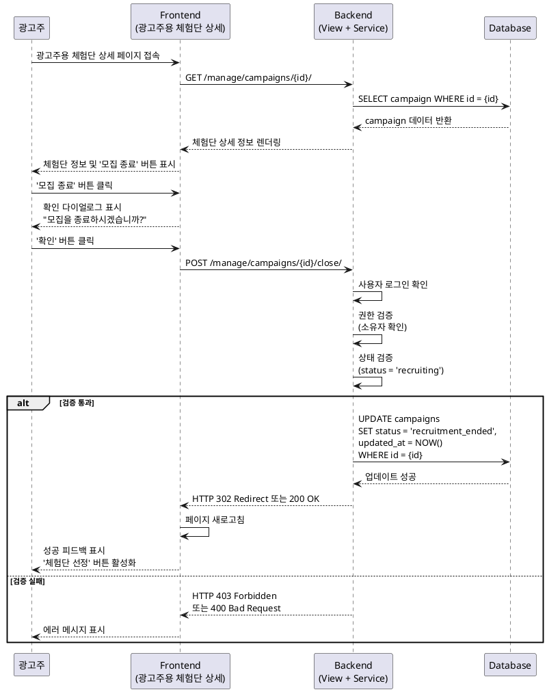

# 유스케이스 작성 템플릿

## 유스케이스 ID: UC-006

### 제목
광고주의 체험단 모집 마감 처리

---

## 1. 개요

### 1.1 목적
광고주가 등록한 체험단의 모집 상태를 수동으로 종료하여 추가 지원자 접수를 차단하고, 선정 단계로 진행할 수 있는 상태로 전환한다.

### 1.2 범위
- 광고주가 자신이 등록한 체험단의 모집을 종료하는 기능
- 모집 중 상태에서 모집 종료 상태로의 전환
- 모집 종료 시 추가 지원 차단 로직 활성화
- 제외 사항: 자동 모집 마감 기능, 모집 재개 기능

### 1.3 액터
- **주요 액터**: 광고주 (Advertiser)
- **부 액터**: 없음

---

## 2. 선행 조건

- 광고주가 로그인한 상태여야 한다.
- 광고주가 최소 1개 이상의 체험단을 등록한 상태여야 한다.
- 대상 체험단의 현재 상태가 '모집 중(recruiting)' 상태여야 한다.
- 광고주가 해당 체험단의 소유자여야 한다.

---

## 3. 참여 컴포넌트

- **광고주용 체험단 상세 페이지 (View)**: 모집 종료 버튼을 렌더링하고 사용자 인터랙션을 처리
- **체험단 관리 서비스 (Service)**: 모집 종료 비즈니스 로직 실행 및 권한 검증
- **Campaign Model**: 체험단 데이터 및 상태 관리
- **데이터베이스**: campaigns 테이블의 status 필드 업데이트

---

## 4. 기본 플로우 (Basic Flow)

### 4.1 단계별 흐름

1. **광고주**: 광고주용 체험단 상세 페이지에 접속
   - 입력: 체험단 ID (URL 파라미터)
   - 처리: 페이지 로드, 현재 체험단 상태 확인
   - 출력: 체험단 상세 정보 및 '모집 종료' 버튼 노출

2. **광고주**: '모집 종료' 버튼 클릭
   - 입력: 버튼 클릭 이벤트
   - 처리: 확인 다이얼로그 표시
   - 출력: "모집을 종료하시겠습니까?" 확인 모달

3. **광고주**: 확인 모달에서 '확인' 버튼 클릭
   - 입력: 확인 액션
   - 처리: POST 요청을 백엔드로 전송
   - 출력: 로딩 상태 표시

4. **백엔드 (View)**: 요청 수신 및 검증
   - 입력: POST 요청 (campaign_id, user)
   - 처리: 사용자 로그인 확인, 서비스 계층으로 요청 위임
   - 출력: 서비스 호출

5. **백엔드 (Service)**: 권한 및 상태 확인
   - 입력: user, campaign_id
   - 처리:
     - 해당 체험단이 존재하는지 확인
     - 요청한 사용자가 체험단의 소유자(advertiser)인지 확인
     - 현재 체험단 상태가 'recruiting'인지 확인
   - 출력: 검증 통과 또는 예외 발생

6. **백엔드 (Service)**: 체험단 상태 업데이트
   - 입력: 검증된 campaign 객체
   - 처리: campaign.status를 'recruiting'에서 'recruitment_ended'로 변경
   - 출력: 업데이트된 campaign 객체 반환

7. **데이터베이스**: 트랜잭션 처리
   - 입력: UPDATE 쿼리 (campaigns.status = 'recruitment_ended', updated_at = NOW())
   - 처리: 데이터베이스 레코드 업데이트
   - 출력: 업데이트 성공

8. **백엔드 (View)**: 성공 응답 반환
   - 입력: 서비스 계층의 성공 결과
   - 처리: 성공 메시지 생성
   - 출력: HTTP 302 Redirect 또는 200 OK 응답

9. **프론트엔드**: 페이지 갱신
   - 입력: 성공 응답
   - 처리: 페이지 새로고침 또는 상태 갱신
   - 출력:
     - '모집 종료' 버튼 비활성화 또는 숨김
     - '체험단 선정' 버튼 활성화
     - 성공 피드백 UI 표시 ("모집이 종료되었습니다.")

### 4.2 시퀀스 다이어그램

---

## 5. 대안 플로우 (Alternative Flows)

### 5.1 대안 플로우 1: 다이얼로그 취소

**시작 조건**: 3번 단계에서 확인 다이얼로그가 표시된 상태

**단계**:
1. 광고주가 확인 모달에서 '취소' 버튼을 클릭한다.
2. 다이얼로그가 닫힌다.
3. 아무런 변경 없이 체험단 상세 페이지 상태를 유지한다.

**결과**: 체험단 상태는 변경되지 않으며, 광고주는 계속 페이지를 확인할 수 있다.

---

## 6. 예외 플로우 (Exception Flows)

### 6.1 예외 상황 1: 권한 없는 접근

**발생 조건**:
- 로그인하지 않은 사용자가 접근한 경우
- 다른 광고주의 체험단에 접근한 경우
- 인플루언서가 광고주 전용 기능에 접근한 경우

**처리 방법**:
1. 백엔드에서 권한 검증 실패를 감지한다.
2. 로그인하지 않은 경우 로그인 페이지로 리디렉션한다.
3. 권한이 없는 경우 403 Forbidden 에러를 반환한다.

**에러 코드**: `403 Forbidden` 또는 `302 Redirect to Login`

**사용자 메시지**: "이 체험단에 접근할 권한이 없습니다." 또는 "로그인이 필요합니다."

### 6.2 예외 상황 2: 이미 마감된 체험단

**발생 조건**:
- 체험단의 현재 상태가 'recruiting'이 아닌 경우
- 다른 세션에서 이미 모집을 종료한 경우
- 이미 선정 완료 상태인 경우

**처리 방법**:
1. 백엔드에서 상태 검증 실패를 감지한다.
2. 400 Bad Request 에러를 반환한다.
3. 프론트엔드에서 에러 메시지를 표시한다.

**에러 코드**: `400 Bad Request`

**사용자 메시지**: "이미 모집이 종료되었거나 선정이 완료된 체험단입니다."

### 6.3 예외 상황 3: 존재하지 않는 체험단

**발생 조건**:
- URL에 잘못된 campaign_id가 입력된 경우
- 삭제된 체험단에 접근한 경우

**처리 방법**:
1. 백엔드에서 Campaign 조회 실패를 감지한다.
2. 404 Not Found 에러를 반환한다.

**에러 코드**: `404 Not Found`

**사용자 메시지**: "존재하지 않는 체험단입니다."

### 6.4 예외 상황 4: 데이터베이스 업데이트 실패

**발생 조건**:
- 데이터베이스 연결 오류
- 트랜잭션 처리 중 예외 발생

**처리 방법**:
1. 백엔드에서 데이터베이스 오류를 캐치한다.
2. 트랜잭션을 롤백한다.
3. 500 Internal Server Error를 반환한다.
4. 에러 로그를 기록한다.

**에러 코드**: `500 Internal Server Error`

**사용자 메시지**: "일시적인 오류가 발생했습니다. 잠시 후 다시 시도해주세요."

---

## 7. 후행 조건 (Post-conditions)

### 7.1 성공 시

- **데이터베이스 변경**:
  - `campaigns` 테이블의 해당 레코드 `status` 필드가 'recruiting'에서 'recruitment_ended'로 변경됨
  - `updated_at` 필드가 현재 시간으로 갱신됨

- **시스템 상태**:
  - 해당 체험단에 대한 신규 지원(Proposal 생성)이 시스템 로직상 차단됨
  - 인플루언서가 체험단 상세 페이지에 접속 시 '지원하기' 버튼이 비활성화되거나 숨김 처리됨
  - 광고주는 '체험단 선정' 단계로 진행할 수 있는 상태가 됨

- **외부 시스템**: 없음

### 7.2 실패 시

- **데이터 롤백**:
  - 모든 데이터베이스 변경사항이 롤백됨
  - campaigns 테이블의 status는 원래 상태를 유지함

- **시스템 상태**:
  - 체험단은 여전히 '모집 중' 상태를 유지함
  - 사용자에게 에러 메시지가 표시됨

---

## 8. 비기능 요구사항

### 8.1 성능
- 모집 종료 요청 처리 시간: 1초 이내
- 동시 요청 처리: 데이터베이스 트랜잭션 격리 수준을 통해 데이터 무결성 보장

### 8.2 보안
- 인증: 로그인된 광고주만 접근 가능
- 권한: 체험단 소유자만 모집 종료 가능 (소유권 검증 필수)
- CSRF 토큰 검증: POST 요청 시 Django CSRF 보호 적용

### 8.3 가용성
- MVP 단계에서는 별도의 고가용성 요구사항 없음
- 데이터베이스 연결 오류 시 적절한 에러 메시지 표시

---

## 9. UI/UX 요구사항

### 9.1 화면 구성

**광고주용 체험단 상세 페이지**

1. **상태 표시 영역**
   - 체험단 상태 뱃지: '모집 중', '모집 종료', '선정 완료' 중 하나
   - 상태에 따라 색상 구분 (예: 모집 중 = 초록색, 모집 종료 = 회색)

2. **액션 버튼 영역**
   - **모집 중 상태일 때**: '모집 종료' 버튼 표시 (Primary 버튼)
   - **모집 종료 상태일 때**: '체험단 선정' 버튼 표시, '모집 종료' 버튼 비활성화 또는 숨김
   - **선정 완료 상태일 때**: 모든 액션 버튼 비활성화

3. **확인 다이얼로그**
   - 제목: "모집 종료 확인"
   - 내용: "모집을 종료하시겠습니까? 종료 후에는 추가 지원자를 받을 수 없습니다."
   - 버튼: '취소' (Secondary), '확인' (Primary, 위험 색상)

4. **피드백 UI**
   - 성공 시: 토스트 메시지 "모집이 종료되었습니다." (2-3초 표시)
   - 실패 시: 토스트 메시지 또는 인라인 에러 메시지 표시

### 9.2 사용자 경험

- **명확한 액션 구분**: 현재 상태에 따라 가능한 액션만 표시하여 혼란 방지
- **의도하지 않은 클릭 방지**: 확인 다이얼로그를 통해 실수로 인한 모집 종료 방지
- **즉각적인 피드백**: 버튼 클릭 시 로딩 상태 표시, 완료 시 명확한 성공/실패 메시지
- **일관된 UI 패턴**: Bootstrap의 표준 모달 및 버튼 스타일 사용

---

## 10. 테스트 시나리오

### 10.1 성공 케이스

| 테스트 케이스 ID | 사전 조건 | 실행 단계 | 기대 결과 |
|----------------|----------|----------|----------|
| TC-006-01 | - 광고주 로그인 상태 - 체험단 상태 = 'recruiting' | 1. 광고주용 체험단 상세 페이지 접속 2. '모집 종료' 버튼 클릭 3. 확인 다이얼로그에서 '확인' 클릭 | - DB의 status가 'recruitment_ended'로 변경 - '체험단 선정' 버튼 활성화 - 성공 메시지 표시 |
| TC-006-02 | - 광고주 로그인 상태 - 체험단 상태 = 'recruiting' - 지원자 1명 이상 존재 | 1. 모집 종료 실행 2. 체험단 상세 페이지에서 지원자 목록 확인 | - 지원자 목록은 그대로 유지 - 지원자 상태는 변경 없음 (여전히 'submitted') |

### 10.2 실패 케이스

| 테스트 케이스 ID | 사전 조건 | 실행 단계 | 기대 결과 |
|----------------|----------|----------|----------|
| TC-006-03 | - 비로그인 상태 | 1. 모집 종료 API 직접 호출 | - 로그인 페이지로 리디렉션 - 또는 401 Unauthorized 에러 |
| TC-006-04 | - 다른 광고주로 로그인 - 타인의 체험단에 접근 | 1. 다른 광고주의 체험단 모집 종료 시도 | - 403 Forbidden 에러 - "권한이 없습니다" 메시지 표시 |
| TC-006-05 | - 광고주 로그인 상태 - 체험단 상태 = 'recruitment_ended' | 1. '모집 종료' 버튼 클릭 시도 | - 400 Bad Request 에러 - "이미 모집이 종료되었습니다" 메시지 표시 |
| TC-006-06 | - 광고주 로그인 상태 - 존재하지 않는 campaign_id | 1. 잘못된 URL로 접근 | - 404 Not Found 에러 - "존재하지 않는 체험단입니다" 메시지 표시 |

### 10.3 Edge Case 테스트

| 테스트 케이스 ID | 사전 조건 | 실행 단계 | 기대 결과 |
|----------------|----------|----------|----------|
| TC-006-07 | - 광고주 로그인 상태 - 체험단 상태 = 'recruiting' - 지원자 0명 | 1. 모집 종료 실행 | - 정상적으로 모집 종료 처리 - 지원자가 없어도 상태 변경 성공 |
| TC-006-08 | - 광고주 로그인 상태 - 두 개의 브라우저 탭에서 동일 페이지 열림 | 1. 첫 번째 탭에서 모집 종료 2. 두 번째 탭에서 모집 종료 시도 | - 첫 번째 탭: 성공 - 두 번째 탭: "이미 종료됨" 에러 |

---

## 11. 관련 유스케이스

- **선행 유스케이스**:
  - UC-005: 신규 체험단 등록 (체험단이 존재해야 모집 종료 가능)
  - UC-003: 체험단 지원 (선택 사항, 지원자가 있든 없든 모집 종료 가능)

- **후행 유스케이스**:
  - UC-007: 체험단 선정 (모집 종료 후 선정 단계로 진행)

- **연관 유스케이스**:
  - UC-004: 내 지원 목록 확인 (모집 종료 시 인플루언서의 지원하기 버튼 비활성화와 연관)

---

## 12. 변경 이력

| 버전 | 날짜 | 작성자 | 변경 내용 |
|------|------|--------|-----------|
| 1.0  | 2025-11-16 | Claude | 초기 작성 |

---

## 부록

### A. 용어 정의

- **모집 중 (Recruiting)**: 체험단이 인플루언서의 지원을 받고 있는 상태
- **모집 종료 (Recruitment Ended)**: 광고주가 지원 접수를 마감한 상태, 아직 선정은 하지 않음
- **선정 완료 (Selection Complete)**: 광고주가 최종 체험단 인원을 선정 완료한 상태
- **권한 검증 (Authorization Check)**: 사용자가 특정 리소스에 대한 조작 권한이 있는지 확인하는 과정
- **CSRF (Cross-Site Request Forgery)**: 외부 사이트에서 악의적으로 요청을 보내는 공격을 방지하는 보안 기법

### B. 참고 자료

- `/docs/userflow.md` - 2.3. 모집 마감 처리 섹션
- `/docs/database.md` - campaigns 테이블 스키마 및 상태 전이 정의
- `/docs/prd.md` - 광고주 사용자 여정 정의
- Django 공식 문서: https://docs.djangoproject.com/
- Bootstrap 모달 컴포넌트: https://getbootstrap.com/docs/5.0/components/modal/
